# JustTryHard - JVM

## External Tools

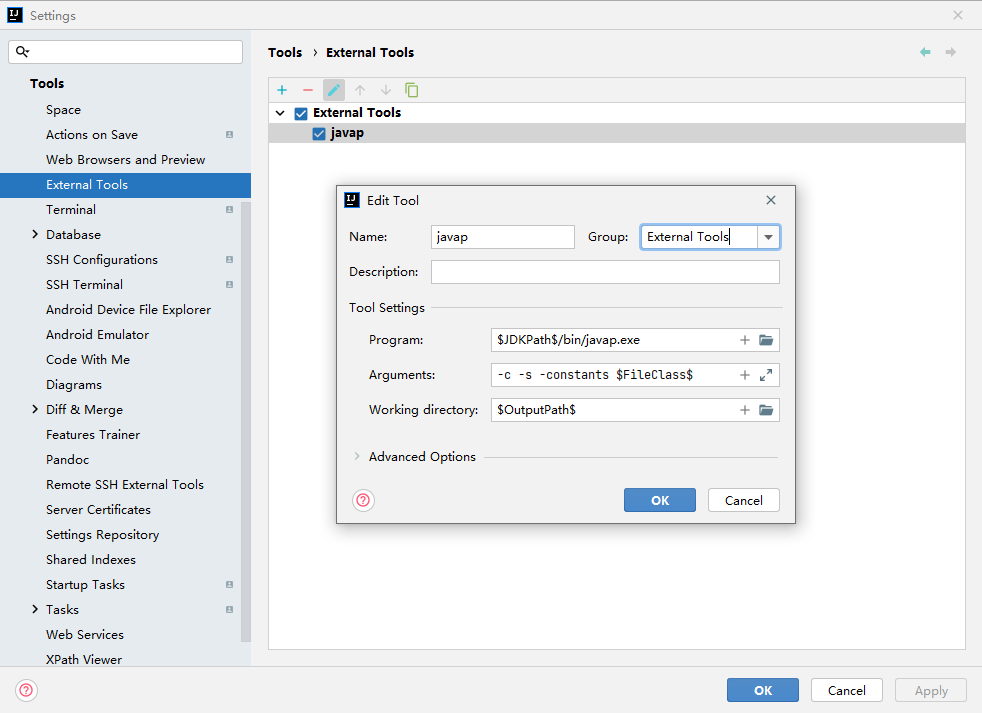

## 第一部分 自动内存管理

> 对于从事C、C++程序开发的开发人员来说，在内存管理领域，他们既是拥有最高权力的“皇帝”， 又是从事最基础工作的劳动人民——既拥有每一个对象的“所有权”，又担负着每一个对象生命从开始 到终结的维护责任。 
>
> 对于Java程序员来说，在虚拟机自动内存管理机制的帮助下，不再需要为每一个new操作去写配对 的delete/free代码，不容易出现内存泄漏和内存溢出问题，看起来由虚拟机管理内存一切都很美好。不 过，也正是因为Java程序员把控制内存的权力交给了Java虚拟机，一旦出现内存泄漏和溢出方面的问 题，如果不了解虚拟机是怎样使用内存的，那排查错误、修正问题将会成为一项异常艰难的工作。

### 第1章 内存区域&内存溢出

#### 1.1 运行时数据区域

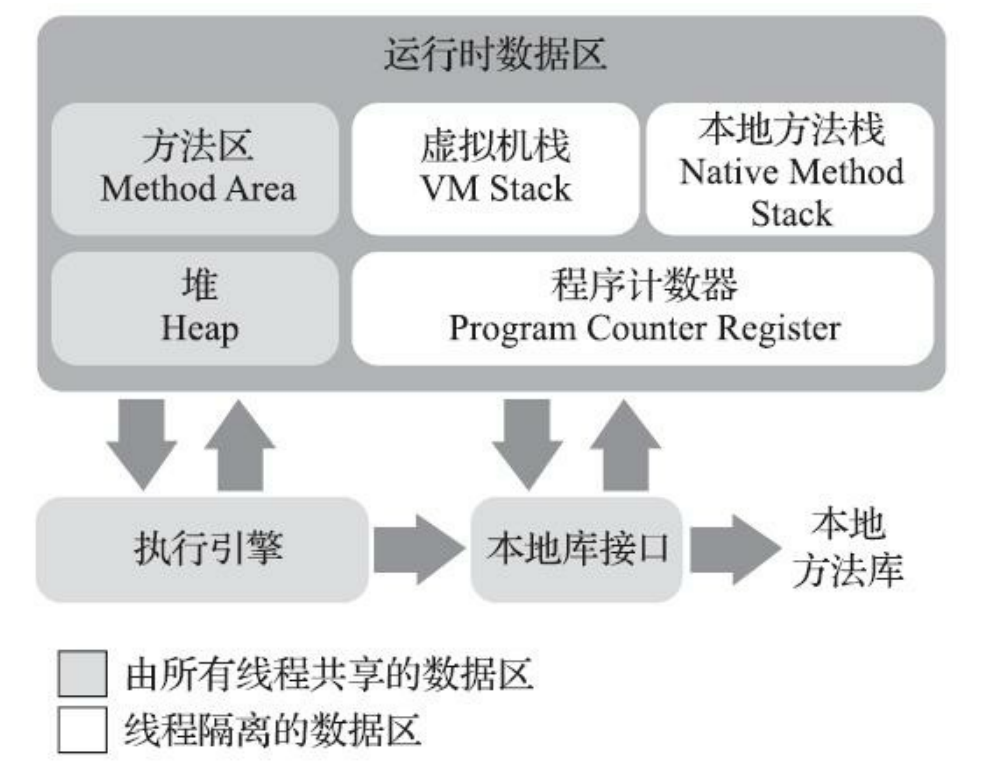

##### 1.1.1 程序计数器

程序计数器（Program Counter Register）是一块较小的内存空间，可以看作是**当前线程所执行的字节码的行号指示器**。在Java虚拟机的概念模型里，字节码解释器工作时就是通过改变这个计数器的值来选取下一条需要执行的字节码指令，它是程序控制流的指示器，分支、循环、跳转、异常处理、线程恢复等基础功能都需要依赖这个计数器来完成。

由于Java虚拟机的多线程是通过线程轮流切换、分配处理器执行时间的方式来实现的，在任何一个确定的时刻，一个内核都只会执行一条线程中的指令。因此为了**确保线程切换后能够恢复到正确的执行位置**，每个线程都需要有一个**独立的程序计数器**，且各线程间的计数器互不影响--**线程私有**。

**此内存区域是唯一一个在《Java虚拟机规范》中没有规定任何 `OutOfMemoryError` 情况的区域。**

##### 1.1.2 Java虚拟机栈

Java虚拟机栈（Java Virtual Machine Stack）也是**线程私有**的，它的生命周期与线程相同。虚拟机栈描述的是**Java方法执行的线程内存模型**：每个方法被执行时，Java虚拟机都会同步创建一个栈帧（Stack Frame）用于**存储局部变量表、操作数栈、动态连接、方法出口**等信息。每一个方法被调用直至执行完毕的过程，就对应着一个栈帧在虚拟机栈中从入栈到出栈的过程。

局部变量表存放了编译期可知的各种Java虚拟机基本数据类型（`boolean、byte、char、short、int、 float、long、double`）、对象引用（reference）和returnAddress 类型（指向了一条字节码指令的地址）。这些数据类型在局部变量表中的存储空间以局部变量槽（Slot）来表示，其中long和double等64位长度的数据会占用2个变量槽，其余数据类型占用一个变量槽。局部变量表所需的内存空间在**编译期**间完成分配，当进入一个方法时，这个方法**需要在栈帧中分配多大的局部变量空间是完全确定的**，在方法运行期间不会改变局部变量表的大小。

在《Java虚拟机规范》中，对这个内存区域规定了两类异常状况：如果线程请求的栈深度大于虚拟机所允许的深度，将抛出 `StackOverflowError` 异常；如果Java虚拟机栈容量可以动态扩展（HotSpot虚拟机栈容量不可扩展），当栈扩展时无法申请到足够的内存会抛出 `OutOfMemoryError` 异常。

##### 1.1.3 本地方法栈

本地方法栈（Native Method Stacks）与虚拟机栈所发挥的作用是非常相似的，其区别只是虚拟机栈为虚拟机执行Java方法（也就是字节码）服务，而本地方法栈则是为虚拟机使用到的本地（Native）方法服务。

与虚拟机栈一样，本地方法栈也会在栈深度溢出或者栈扩展失 败时分别抛出 `StackOverflowError` 和 `OutOfMemoryError` 异常。

##### 1.1.4 Java堆

Java堆（Java Heap）是虚拟机所管理的内存中最大的一块，是被所有**线程共享**的一块内存区域，在虚拟机启动时创建。此内存区域的唯一目的就是存放对象实例：The heap is the runtime data area from which memory for all class instances and arrays is allocated. 但随着Java语言的发展，现有些许迹象表明并不是所有对象都必须分配在堆上：即时编译，尤其是逃逸分析技术（栈上分配、标量替换）。

Java堆是垃圾收集器管理的内存区域，因此也通常被称为“GC堆”。从内存回收的角度看，由于现代垃圾收集器大部分都是基于分代收集理论设计的，所以经常会出现“新生代”“老年代”“永久代”“Eden空间”“From Survivor空间”“To Survivor空间”等名词。作为业界绝对主流的HotSpot虚拟机，它内部的垃圾收集器全部都基于“经典分代”（指新生代（其中又包含一个Eden和两个Survivor）、老年代）来设计，但到了今天，随着技术的不断发展，很多东西出现了变数，HotSpot里面也出现了不采用分代设计的新垃圾收集器。

根据《Java虚拟机规范》的规定，Java堆可以处于物理上不连续的内存空间中，但在逻辑上它应该被视为连续的，就像磁盘存储一样。

如果在Java堆中没有内存完成实例分配，并且堆也无法再扩展时，Java虚拟机将会抛出 `OutOfMemoryError` 异常。

##### 1.1.5 方法区

方法区（Method Area）与Java堆一样，是各个**线程共享**的内存区域，它用于存储已被虚拟机加载的**类型信息、常量、静态变量、即时编译器编译后的代码缓存**等数据，如类名、访问修饰符、常量池、字段描述、方法描述等。虽然《Java虚拟机规范》中把方法区描述为堆的一个逻辑部分，但是它却有一个别名叫作**“非堆”（Non-Heap）**，目的是**与Java堆区分**开来。

“永久代”，在JDK 8以前，我们更喜欢把方法去称呼为“永久代”，其实**两者并不等价**，仅仅是当时HotSpot虚拟机的设计团队选择使用永久代来实现方法区，使得HotSpot的垃圾收集器能够**像管理Java堆一样管理**这部分内存，**省**去专门位方法去编写内存管理代码的工作。带来的问题：永久代有 `-XX：MaxPermSize` 的上限，即使不设置也有**默认大小**，易导致内存溢出。在JDK 6时HotSpot开发团队就有了放弃永久代的想法，到JDK 7时，已经把原本放在永久代的**字符串常量池、静态变量**等移出，而到了JDK 8，终于完全废弃了永久代的概念，改用与JRockit、J9一样在本地内存中实现的元空间（Meta-space）来代替，把JDK 7中永久代还剩余的内容（主要是类型信息）全部移到元空间中。

根据《Java虚拟机规范》的规定，如果方法区无法满足新的内存分配需求时，将抛出 `OutOfMemoryError` 异常。

##### 1.1.6 运行时常量池

运行时常量池（Runtime Constant Pool）是**方法区的一部分**。Class文件中除了有类的版本、字段、方法、接口等描述信息外，还有一项信息是常量池表（Constant Pool Table），用于存放**编译期生成的各种字面量与符号引用**，这部分内容将在类加载后存放到方法区的运行时常量池中。

运行时常量池相对于Class文件常量池的另外一个重要特征是具备**动态性**，Java语言并**不要求常量一定只有编译期才能产生**，也就是说，并非预置入Class文件中常量池的内容才能进入方法区运行时常量池，运行期间也可以将新的常量放入池中，这种特性被开发人员利用得比较多的便是String类的 `intern()` 方法。

*待补充：字符串常量池与运行时常量池。*

##### 1.1.7 直接内存

直接内存（Direct Memory）并不是虚拟机运行时数据区的一部分，也不是《Java虚拟机规范》中定义的内存区域。但这部分内存也在被频繁地使用，并且也会导致 `OutOfMemoryError` 异常。

在JDK 1.4中新加入了NIO（New Input/Output）类，引入了一种基于通道（Channel）于缓冲区（Buffer）的I/O方式，它可以直接使用Native函数库直接分配堆外内存，然后通过一个存储在Java堆里面的 `DirectByteBuffer` 对象作为这块内存的引用进行操作。此方案避免了在Java堆和Native堆中来回复制数据，因此在一些场景中能显著提升性能。

虽然直接内存的分配并不会受到Java堆大小的限制，但既然是内存，则还是会收到本机总内存存（包括物理内存、SWAP分区或者分页文件）大小以及处理器寻址空间的限制，一般服务器管理员配置虚拟机参数时，会根据实际内存去设置-Xmx等参数信息，但经常忽略掉直接内存，使得各个内存区域总和大于物理内存限制（包括物理的和操作系统级的限制），从而导致动态扩展时出现 `OutOfMemoryError` 异常。

#### 1.2 HotSpot虚拟机对象

##### 1.2.1 对象创建

##### 1.2.2 对象内存布局

##### 1.2.3 对象访问定位

#### 1.3 `OutOfMemoryError`异常

##### 1.3.1 Java堆溢出

Java堆用于储存对象实例，GC Roots到对象之间有可达路径时，该对象将不会被垃圾回收机制回收，那么随着这种对象的增加时，总容量触及最大堆的容量限制后就会产生内存溢出异常。

```java
public class MemoryTest {

    /**
     * -Xms20m -Xmx20m -XX:-UseGCOverheadLimit -XX:+HeapDumpOnOutOfMemoryError
     */
    @Test
    public void heap() {
        List<MemoryTest> list = new LinkedList<>();

        while (true) {
            list.add(new MemoryTest());
        }
    }
}
```

如果是内存泄漏，可通过内存分析工具查看泄漏对象到GC Roots的引用链，找到泄漏对象是通过怎样的引用路径、于哪些GC Roots相关联，才导致垃圾收集器无法回收它们。

如果不是内存泄漏，则表示运行时内存中的对象确实是必须存活的，那么应当检查Java虚拟机的堆参数（-Xms于-Xmx）设置是否还有可调空间。检查代码是否存在某些对象生命周期过长、持有状态时间过长、存储结构设计不合理等情况，尽量减少程序运 行期的内存消耗。

##### 1.3.2 栈溢出

**HotSpot虚拟机中并不区分虚拟机栈和本地方法栈**，因此对HotSpot虚拟机来说 `-Xoss` 参数（设置本地方法栈大小）虽然存在但没有任何实际效果，栈容量只能由 `-Xss` 参数来设定。关于虚拟机栈和本地方法栈，在《Java虚拟机规范》中描述了两种异常：

1. 如果线程请求的栈深度大于虚拟机所允许的最大深度，将抛出 `StackOverflowError` 异常
2. 如果虚拟机的栈容量支持动态扩展，当扩展栈容量无法申请到足够内存时，将抛出 `OutOfMemoryError` 异常

《Java虚拟机规范》允许Java虚拟机实现自行选择是否支持栈动态扩展，而**HotSpot**恰好选择了**不支持扩展**，所以除非在创建线程申请内存时就因无法获得足够内存而出现 `OutOfMemoryError` 异常，否则在线程运行时不会因为扩展栈而导致内存溢出，只会因为栈容量无法容纳新的栈帧而导致 `OutOfMemoryError` 异常。

为此，准备了两个实验用于验证，首先均将实验范围限制在**单线程**中，尝试能否产生 `OutOfMemoryError` 异常：

- 使用 `-Xss` 参数减小栈内存容量

  结果：`StackOverflowError` 异常

- 定义大量的本地变量

  结果：`StackOverflowError` 异常，异常出现时堆栈深度相应缩小

```java
public class MemoryTest {
    private int stackLength = 1;
    
    public void stackLeak1() {
        stackLength++;
        stackLeak1();
    }

    /**
     * -Xss128k
     */
    @Test
    public void stack1() {
        try {
            stackLeak1();
        } catch (Throwable e) {
            System.out.println("stack length is: " + stackLength);
            throw e;
        }
    }
    // 运行结果：
    /**
     * stack length is: 936
     *
     * java.lang.StackOverflowError
     * 	at com.deemo.MemoryTest.stackLeak1(MemoryTest.java:24)
     * 	at com.deemo.MemoryTest.stackLeak1(MemoryTest.java:25)
     * 	at com.deemo.MemoryTest.stackLeak1(MemoryTest.java:25)
     * 	at com.deemo.MemoryTest.stackLeak1(MemoryTest.java:25)
     * 	...
     */
     
}
```

对于不同版本的Java虚拟机和不同的操作系统，栈容量的最小值可能会有所限制，这主要取决于操作系统内存分页大小。如果低于最小限制，HotSpot虚拟机启动时将会给出如下异常提示：

Error: Could not create the Java Virtual Machine.
The stack size specified is too small, Specify at least 108k
Error: A fatal exception has occurred. Program will exit.

```java
public class MemoryTest {
    private int stackLength = 1;

    public void stackLeak2() {
        long no0, no10, no20, no30, no40, no50, no60, no70, no80, no90,
                no1, no11, no21, no31, no41, no51, no61, no71, no81, no91,
                no2, no12, no22, no32, no42, no52, no62, no72, no82, no92,
                no3, no13, no23, no33, no43, no53, no63, no73, no83, no93,
                no4, no14, no24, no34, no44, no54, no64, no74, no84, no94,
                no5, no15, no25, no35, no45, no55, no65, no75, no85, no95,
                no6, no16, no26, no36, no46, no56, no66, no76, no86, no96,
                no7, no17, no27, no37, no47, no57, no67, no77, no87, no97,
                no8, no18, no28, no38, no48, no58, no68, no78, no88, no98,
                no9, no19, no29, no39, no49, no59, no69, no79, no89, no99;

        stackLength++;
        stackLeak2();
    }

    @Test
    public void stack2() {
        try {
            stackLeak2();
        } catch (Throwable e) {
            System.out.println("stack length is: " + stackLength);
            throw e;
        }
    }
    // 运行结果：
    /**
     * stack length is: 6542
     *
     * java.lang.StackOverflowError
     * 	at com.deemo.MemoryTest.stackLeak2(MemoryTest.java:53)
     * 	at com.deemo.MemoryTest.stackLeak2(MemoryTest.java:54)
     * 	at com.deemo.MemoryTest.stackLeak2(MemoryTest.java:54)
     * 	...
     */

}
```

实验表明，无论是由于栈帧太大还是虚拟机栈容量大小，当新的栈帧内存无法分配的时候，HotSpot虚拟机均抛出 `StackOverflowError` 异常。

如上测试均在单线程中进行测试，如果不是基于单线程，而是通过不断建立线程的方式，在HotSpot上也是可以产生内存溢出的异常。但是这样产生的内存溢出异常和栈空间是否足够并不存在任何直接的关系，主要取决于操作系统本身的内存使用状态。甚至在这种情况下，**给每个线程的栈分配的内存越大，反而越容易出现内存溢出**。

操作系统分配给每个进程的内存是有限制的，譬如32位Windows的单个进程最大内存限制为2GB。HotSpot虚拟机提供了参数可以控制Java堆和方法去这两部分的内存最大值，如果忽略内存消耗很小的程序计数器再忽略直接内存，那么Java进程内存分配为：

Java进程总内存 = Java进程自身消耗 + 堆容量 + 方法区容量 + 栈（虚拟机栈和本地方法栈）。因此为每个线程分配到的栈内存越大，可以建立的线程数量自然就越少，建立线程时就越容易把剩下的内存耗尽。

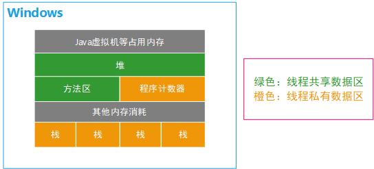

使用HotSpot虚拟机默认参数，栈深度再大多数情况下能够达到1000~2000，对于正常方法调用来说应该足够使用了。如果是建立过多线程导致的内存溢出，在不能减少线程数量或者更换64位虚拟机的情况下，就可以通过**减少最大堆和减少栈容量来换取更多的线程**。

##### 1.3.3 方法区、运行时常量池溢出

运行时常量池是方法区的一部分，所以这两个区域的溢出测试可以一起进行。HotSpot从JDK 7开始逐步“去永久代”，并在JDK 8中完全使用元空间来代替永久代。

`String::intern()` 是一个本地方法，它的作用是**如果字符串常量池中已经包含一个等于此 String 对象的字符串，则返回代表池中这个字符串的 String 对象的引用；否则，会将此 String 对象包含的字符串添加到常量池中，并且返回此 String 对象的引用。**（在JDK 6或更早之前的HotSpot虚拟机中，常量池都是分配在永久代中，我们可以通过 `-XX: PermSize` 和 `-XX: MaxPermSize` 限制永久代的大小，即可间接限制其中常量池的容量。）

```java
/**
 * -XX:PermSize=6M -XX:MaxPermSize=6M
 * -Xms6M -Xmx6M
 */
@Test
public void rcpTest() {
    Set<String> set = new HashSet<>();
    int i = 0;

    while (true) {
        // set.add(String.valueOf(i++));
        set.add(String.valueOf(i++).intern());
    }
    
    // 运行结果：JDK 6
    /**
     * Exception in thread "main" java.lang.OutOfMemoryError: PermGen space
     * 	at java.lang.String.intern(Native Method)
     * 	at com.deemo.MemoryTest6.main(MemoryTest6.java from InputFileObject:14)
     */
    
    // 运行结果：JDK 7↑
    /**
     * java.lang.OutOfMemoryError: Java heap space
     *
     * 	at java.lang.Integer.toString(Integer.java:403)
     * 	at java.lang.String.valueOf(String.java:3099)
     * 	at com.deemo.MemoryTest.rcpTest(MemoryTest.java:102)
     */
    /**
     * java.lang.OutOfMemoryError: Java heap space
     *
     * 	at java.util.HashMap.newNode(HashMap.java:1747)
     * 	at java.util.HashMap.putVal(HashMap.java:642)
     * 	at java.util.HashMap.put(HashMap.java:612)
     * 	at java.util.HashSet.add(HashSet.java:220)
     * 	at com.deemo.MemoryTest.rcpTest(MemoryTest.java:102)
     */
}
```

使用JDK 6运行以上代码将出现 `PermGen space` 异常，而在JDK 7及以上版本运行，几乎不会出现溢出异常，循环将一直进行下去。

关于字符串常量池的实现，引生出一些更有意思的影响：[点击就送]()

方法区主要职责是用于存放类型的相关信息，如类名、访问修饰符、常量池、字段描述、方法描述等。对于这部分的测试，基本思路是运行时产生大量的类区填满方法区，直到溢出为止。

```java
/**
 * -XX:PermSize=10M -XX:MaxPermSize=10M
 * -XX:MetaspaceSize=10M -XX:MaxMetaspaceSize=10M
 */
@Test
public void methodAreaTest() {
    try {
        while (true) {
            Enhancer enhancer = new Enhancer();
            enhancer.setSuperclass(Object.class);
            enhancer.setUseCache(false);
            enhancer.setCallback(new MethodInterceptor() {
                @Override
                public Object intercept(Object o, Method method, Object[] objects, MethodProxy methodProxy) throws Throwable {
                    return methodProxy.invokeSuper(o, objects);
                }
            });

            enhancer.create();
        }
    } catch (Exception e) {
        System.err.println(e.getCause().getCause());
    }

    // 运行结果：JDK 7
    /**
     * java.lang.OutOfMemoryError: PermGen space
     */
    // 运行结果：JDK 8
    /**
     * java.lang.OutOfMemoryError: Metaspace
     */
}
```

借助 CGLib 使得方法区出现内存溢出异常。当前很多主流框架，如Spring、Hibernate对类进行增强时，都会使用到 CGLib 这类字节码技术，**当增强的类越多，就需要越大的方法区以保证动态生成的新类型可以载入内存**。

方法区溢出也是一种常见的内存溢出异常，一个类如果要被垃圾收集器回收，要达成的调价你是比较苛刻的。运行时经常生成大量动态类的应用场景里，除了 CGLib 外，常见的还有：大量JSP或动态产生JSP文件的应用（JSP第一次运行时需要编译为Java类）、基于OSGI的应用（即使是同一个类文件，被不同的加载器加载也会视为不同的类）等。

在JDK 8以后，永久代便完全退出了历史舞台，元空间作为其替代者登场。在默认设置下上述场景已很难再导致方法区溢出异常，HotSpot仍然提供了一些参数作为元空间的防御措施：

- ` -XX:MaxMetaspaceSize`：元空间最大值。默认是-1，即只受限于本地内存大小。
- `-XX:MetaspaceSize`：元空间初始大小，以字节为单位，达到该值将触发垃圾收集进行类型卸载，同时收集器会对该值进行调整：如果释放了大量的空间，就适当降低该值；否则，再不超过 ` -XX:MaxMetaspaceSize` 的情况下（如果有设置），适当提高该值。
- ` -XX:MiniMetaspaceFreeRatio`：在垃圾收集之后控制最小的元空间剩余容量的百分比，可减少因为元空间不足导致的垃圾收集频率。类型的还有 `-XX:Max-MetaspaceFreeRatio`，用于控制最大的元空间剩余容量的百分比。

##### 1.3.4 直接内存溢出

直接内存（Direct Memory）的容量大小可通过 `-XX:MaxDirectMemorySize` 参数来指定，如果不去指定，则默认与Java堆最大值（由 `-Xmx` 指定）一致。

```java
@Test
public void directMemoryTest() throws IllegalAccessException {
    final int _1MB = 1024 * 1024;

    Field unsafeField = Unsafe.class.getDeclaredFields()[0];
    unsafeField.setAccessible(true);
    Unsafe unsafe = (Unsafe) unsafeField.get(null);
    while (true) {
        unsafe.allocateMemory(_1MB);
    }

    // 运行结果
    /**
     * java.lang.OutOfMemoryError
     * 	at sun.misc.Unsafe.allocateMemory(Native Method)
     * 	at com.deemo.MemoryTest.directMemoryTest(MemoryTest.java:172)
     */
}
```

越过 `DirectByteBuffer` 类直接通过反射获取 `Unsafe` 实例进行内存分配（ `Unsafe` 类的 `getUnsafe()` 方法指定只有引导类加载器才会返回实例，体现了设计者希望只有虚拟机标准类库里面的类才能使用 `Unsafe` 的功能，在JDK 10时才将 `Unsafe` 的部分功能通过 `VarHandle` 开放给外部使用），因为**虽然使用 `DirectByteBuffer` 分配内存也会抛出内存溢出异常，但它抛出异常时并没有真正想操作系统申请分配内存，而是通过计算得知内存无法分配就会在代码中手动抛出异常，真正申请分配内存的方法是 `Unsafe::allocateMemory()`。**

由**直接内存导致的内存溢出**，一个明显的特征是**在Heap Dump文件中不会看见由什么明显的异常情况**，如果发现内存溢出之后产生的**Dump文件很小**，而程序中又间接或直接使用了Direct Memory（**典型间接使用便是NIO**），那么就可以考虑重点检查一下直接内存方面的原因了。

#### 1.4 小结

到此为止，梳理了虚拟机中的内存是如何划分的，**哪部分区域、什么样的代码和操作可能导致内存溢出异常**。虽然Java有垃圾收集机制，但内存溢出异常离我们并不遥远，**本章只是讲解了各个区域出现内存溢出异常的原因**，下一章将详细讲解Java垃圾收集机制为了避免出现内存溢出异常都做了哪些努力。

### 第2章 垃圾收集器与内存分配策略

> Java与C++之间有一堵由内存动态分配和垃圾收集技术所围成的高墙，墙外面的人想进去，墙里面的人却想出来。

#### 2.1 概述

说起垃圾收集（Garbage Collection: GC），有不少人把这项技术当作Java语言的伴生产物。事实上，垃圾收集的历史远远比Java久远，在1960年诞生于麻省理工学院的Lisp是第一门开始使用内存动态分配和垃圾收集技术的语言。当Lisp还在胚胎时期时，其作者John McCarthy就思考过垃圾收集需要完成的三件事情：

- 哪些内存需要回收？
- 什么时候回收？
- 如何回收？

到今天，内存动态分配与内存回收技术已经相当成熟，一切看起来都进入了“自动化”时代，那为什么我们还要去了解垃圾收集和内存分配？答案很简单：**当需要排查各种内存溢出、内存泄漏问题时，当垃圾收集成为系统达到更高并发量的瓶颈时**，我们就必须对这些“自动化”的技术实施必要的监控和调节。

在第1章介绍了Java内存运行时区域的各个部分，其中***程序计数器、虚拟机栈、本地方法栈*3个区域随线程而生随线程而灭，栈中的栈帧随着方法的进入和退出而有条不紊地执行着出栈和入栈操作。每一个栈帧中分配多少内存基本上是在类结构确定下来时就已知的**（尽管在运行期会由***即时编译器***进行一些优化，但在基于概念模型的讨论里，大体上可以任务是编译器可知的），因此这几个区域的内存分配和回收都具有确定性，在这几个区域内就不需要过多考虑如何回收的问题，当方法结束或者线程结束时，内存自然就跟随着回收了。

而**Java堆和方法区这两个区域则有着很显著的不确定性**：一个接口的多个实现类需要的内存可能会不一样，一个方法所执行的不同条件分支所需要的内存也可能不一样，**只有处于运行期间，我们才能知道程序究竟会创建哪些对象，创建多少对象，这部分内存的分配和回收是动态的**。垃圾收集器所关注的正是这部分内存该如何管理，本文后续讨论中的“内存”分配与回收也仅仅特指这一部分的内存。

#### 2.2 对象已死？

在堆里面存放着Java世界中几乎所有的对象实例，垃圾收集器在对堆进行回收前，第一件事情就是要确定这些对象之中哪些还“存活”着，哪些已经“死去”（“死去”即不可能再被任何途径使用的对象）了。

##### 2.2.1 引用计数算法

很多教科书判断对象是否存活的算法是这样的：在对象中添加一个引用计数器。每当有一个地方引用它时，计数器加一；当引用失效时，计数器减一；当计数器为0时，表示对象已不可能再被使用。

客观来说，引用计数算法（Reference Counting）虽然占用了一些额外内存空间来进行计数，但它原理简单，判定效率也高，在**大多数情况下**都是一个不错的算法。但是，在Java领域中，主流的Java虚拟机都没有采用引用计数算法来管理内存，原因很简单，这个看似简单的算法需要额外考虑很多情况，必须添加额外大量代码才能保证正确工作，譬如说循环引用问题。

##### 2.2.2 可达性分析算法

当前主流的商用程序语言（Java、C++）的内存管理子系统，都是引用可达性分析（）算法来判定对象是否存活的。这个算法的基本思路就是通过一系列称为“**GC Roots**”的根对象作为起始结果集，从这些节点开始，根据引用关系向下搜索，搜索过程所走过的路径被称为“引用链”（），如果某个对象到GC Roots之间没有任何引用链相连，或者用图论解释即GC Roots到某个对象不可达时，表示该对象已不可能再被使用了。

如图，object5、object 6和object 7虽然互有关联，但他们到GC Roots之间是不可达的，因此它们将被判定为可回收对象。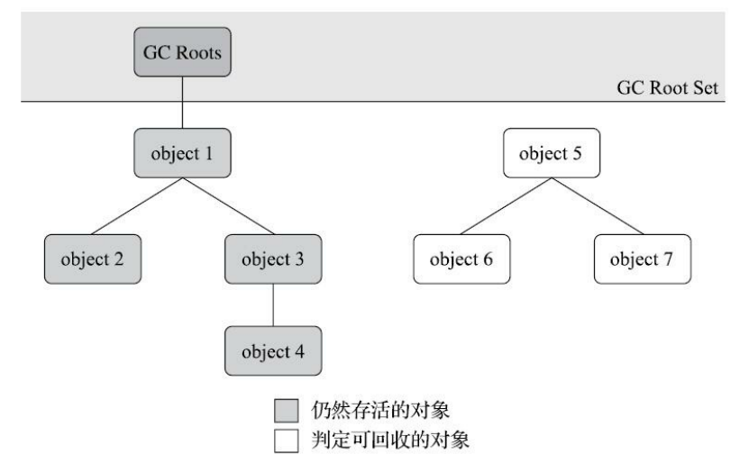

**在Java体系中，固定可作为GC Roots的对象包括以下几种**：

1. 在虚拟机栈（栈帧中的本地变量表）中引用的对象，譬如各个线程被调用的方法堆栈中使用到的参数、局部变量、临时变量等
2. 在方法区中类静态属性引用的对象，例如Java类的引用类型静态变量
3. 在方法区中常量引用的对象，例如字符串常量池（String Table）里的引用
4. 在本地方法栈中JNI（通常所说的Native方法）引用的对象
5. 虚拟机内部的引用用，如基本数据类型对应的Class对象，一些常驻的异常对象（比如 NullPointExcepiton、OutOfMemoryError）等，还有系统类加载器
6. 所有被同步锁（synchronized）持有的对象
7. 反映Java虚拟机内部情况的JMXBean、JVMTI中注册的回调、本地代码缓存等

除了这些固定的GC Roots外，根据用户所选用的垃圾收集器以及当前回收的内存区域不同，还可以对其他对象“临时性”地加入，共同构成完整的GC Roots集合。

##### 2.2.3 再谈引用

无论是使用引用计数算法判断对象的引用数量，还是通过可达性分析算法判断对象是否引用链可达，判断对象是否存活都跟“引用”离不开关系。在JDK 1.2版之前，Java里面的引用是很传统的定义：如果reference类型的数据中存储的数值代表的是另外一块内存的起始地址，就称该reference数据是代表某块内存、某个对象的引用。这种定义在现在看来有些过于狭隘了，仅有“被用”与“未引用”两种状态，对于那些“食之无味、弃之可惜”的对象就显得有些无力了，譬如某些对象在垃圾收集过后内存仍然显得比较紧张时，就可以回收他们。

在JDK1.2版本之后，Java对引用概念进行了扩充，将引用分为：强引用（Strongly Re-ference）、软引用（Soft Reference）、弱引用（Weak Reference）和虚引用（Phantom Reference）4种，引用强度依次减弱。

- 强引用：最“传统”的引用描述，类似：`Object a = new Object()`，**被强引用的对象永远不会被回收**
- 软引用：用来描述一些还有用、但非必须的对象。只被软引用关联着的对象，**在系统将要发生内存溢出前，会对此部分对象进行第二次回收**，如果回收后内存依然紧张，那么将会抛出内存溢出溢出。在JDK 1.2版之后提供了SoftReference类来实现软引用
- 弱引用：也是用来描述一些非必须的对象，它的引用强度比软引用更低一些，被弱引用关联的对象**活不过下一次垃圾回收**。在垃圾收集器开始工作时，无论内存是否足够，都会回收掉只被弱引用关联的对象。在JDK 1.2版之后提供了WeakReference类来实现弱引用
- 虚引用：也被称为“幽灵引用”或“幻影引用”，它是最弱的一种引用关系。一个对象是否有虚引用关联关系，完全**不影响**其生存时间，也无法通过虚引用来取得一个对象实例。为一个对象设置虚引用的关联的唯一目的只是为了**能在这个对象在被垃圾收集器回收时收到一个通**知。在JDK 1.2版之后提供 了PhantomReference类来实现虚引用

##### 3.2.4 生存还是死亡？

即使在可达性分析算法中判定为不可达的对象也不是“非死不可”的，这时候它们暂时还处于“缓刑”阶段，要真正宣告一个对象死亡，至少要经历**两次**标记过程：如果对象在经过可达性分析后发现没有与GC Roots相连的引用链，那它将被第一次标记，随后进行一次筛选，筛选的条件是此对象是否有必要执行 `finalize()` 方法。**假如对象没有覆盖 `finalize()` 方法或者 `finalize()` 方法*已经被虚拟机调用*过，那么虚拟机将这两种情况都视为“没有必要执行”。**

如果这个对象被判定为有必要执行 `finalize()` 方法，那么该对象将会被放置在一个名为 `F-Queue` 的队列中，并在稍后由一条虚拟机自动建立的、低调低优先级的 `Finalizer` 线程去执行它们的 `finalize()` 方法。这里所说的“执行”是指虚拟机会**触发**这个方法开始执行，但并**不承诺一定会等待它运行结束**。这样做的原因是，如果某个对象的 `finalize()` 方法执行缓慢，或者极端情况下进入了死循环，将很有可能导致 `F-Queue` 队列中的其他对象永久处于等待状态，甚至导致整个内存回收子系统崩溃。`finalize()` 方法是对象逃脱死亡命运的的最后一次机会，稍后收集器会对 `F-Queue` 中的对象进行第二次小规模的标记，**如果对象在 `finalize()` 中成功拯救自己** -- 重新于引用链上的对象建立引用关系，那么在稍后的第二次标记时将被移除“缓刑”状态，否则，那基本上它就真的要被回收了。

```java
public class FinalizeTest {
	private static FinalizeTest SAVE_HOOK = null;

	private void isAlive() {
		System.out.println("Yeah, I'm still alive!");
	}

	@Override
	protected void finalize() throws Throwable {
		super.finalize();
		System.out.println("finalize execute.");
		SAVE_HOOK = this;
	}

	public static void main(String[] args) throws InterruptedException {
		SAVE_HOOK = new FinalizeTest();
		SAVE_HOOK = null;

		// 第一次拯救自己
		System.gc();
		// finalize 优先级较低，等待 500ms
		Thread.sleep(500);

		if (SAVE_HOOK != null) {
			SAVE_HOOK.isAlive();
		} else {
			System.out.println("No, I am dead!");
		}

		SAVE_HOOK = null;
		// 第二次不会再调用 finalize
		System.gc();
		// finalize 优先级较低，等待 500ms
		Thread.sleep(500);

		if (SAVE_HOOK != null) {
			SAVE_HOOK.isAlive();
		} else {
			System.out.println("No, I am dead!");
		}
	}

}

/**
 * finalize execute.
 * Yeah, I'm still alive!
 * No, I am dead!
 */
```

从执行结果来看，`finalize()` 确实有被触发且已逃脱，但相同的代码在第二次执行时，`finalize()` 并没有再被触发，因此逃脱失败。这是因为一个对象的 `finalize()` 方法只会被调用一次，因此第二段相同代码将不会执行 `finalize()` 方法，对象逃脱也将会失败。

Java虽然有此机制，但在具体开发中**不建议使用**该机制，因其调用不确定性，`finalize()` 能做的事情，`try-finally` 同样能做，甚至做得更好。

##### 3.2.5 回收方法区

有些人认为方法区（如HotSpot虚拟机中的元空间或者永久代）是没有垃圾收集行为的，《Java虚 拟机规范》中**提到过可以不要求虚拟机在方法区中实现垃圾收集**，事实上也确实有未实现或未能完整 实现方法区类型卸载的收集器存在（如JDK 11时期的ZGC收集器就不支持类卸载），方法区垃圾收集的“性价比”通常也是比较低的：在Java堆中，尤其是在新生代中，对常规应用进行一次垃圾收集通常可以回收70%至99%的内存空间，相比之下，方法区回收囿于苛刻的判定条件，其区域垃圾收集的回收成果往往远低于此。 

**方法区的垃圾收集主要回收两部分内容：废弃的常量和不再使用的类型**。回收废弃常量与回收Java堆中的对象非常类似。举个常量池中字面量回收的例子，假如一个字符串“java”曾经进入常量池中，但是当前系统又没有任何一个字符串对象的值是“java”，换句话说，已经没有任何字符串对象引用 常量池中的“java”常量，且虚拟机中也没有其他地方引用这个字面量。如果在这时发生内存回收，而且垃圾收集器判断确有必要的话，这个“java”常量就将会被系统清理出常量池。常量池中其他类（接 口）、方法、字段的符号引用也与此类似。 

判定一个常量是否“废弃”还是相对简单，而要判定一个类型是否属于“不再被使用的类”的条件就比较苛刻了。需要同时满足下面三个条件：

1. 该类所有的实例都已经被回收，也就是Java堆中不存在该类及其任何派生子类的实例
2. 加载该类的类加载器已经被回收，这个条件除非是经过精心设计的可替换类加载器的场景，如OSGi、JSP的重加载等，否则通常是很难达成的
3. 该类对应的java.lang.Class对象没有在任何地方被引用，无法在任何地方通过反射访问该类的方 法

Java虚拟机**被允许**对满足上述三个条件的无用类进行回收，这里说的仅仅是“被允许”，而并不是和对象一样，没有引用了就必然会回收。关于是否要对类型进行回收，HotSpot虚拟机提供了Xnoclassgc参数进行控制，还可以使用 `-verbose: class` 以及 `-XX: +TraceClass-Loading`、`-XX: +TraceClassUnLoading` 查看类加载和卸载信息，其中 `-verbose: class` 和 `-XX: +TraceClassLoading` 可以在 Product版的虚拟机中使用，`-XX: +TraceClassUnLoading` 参数需要FastDebug版^[1]^的虚拟机支持。 

在大量使用**反射、动态代理、CGLib**等字节码框架，**动态生成JSP以及OSGi**这类频繁自定义类加载器的场景中，通常都需要Java虚拟机具备类型卸载的能力，以保证不会对方法区造成过大的内存压力。

####  3.3 垃圾收集算法

引用计数

复制、拷贝

标记、清除

标记、整理

### 第3章 虚拟机性能监控、故障处理工具

### 第4章 调优案例分析与实战

## 番外篇

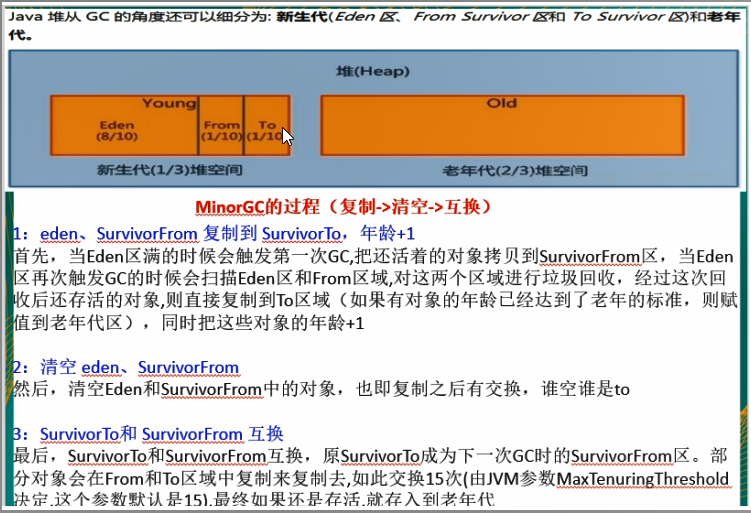

- **新生代默认占堆内存 1/3，养老区占堆内存 2/3**
- **新生代还可以细分为：Eden、From Survivor 和 To Survivor区，默认比例：Eden:S0:S1 = 8:1:1**

### 番一 JVM 参数

#### 1.1 JVM 参数类型

##### 1.1.1 标配参数

`-version`

`-help`

`-showversion`：`-version` + `-help`

##### 1.1.2 x参数（了解）

`-Xint`：解释执行

`-Xcomp`：第一次使用就编译成本地代码

`-Xmixed`：混合模式

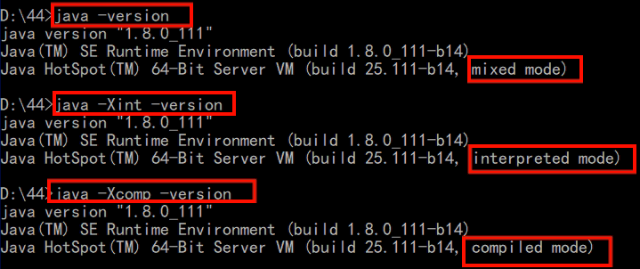

##### 1.1.3 ==xx参数==

###### 1.1.3.1 Boolean 类型

`-XX:+/- name`：+ 开启、- 关闭

1. 是否打印 GC 收集细节

   `-XX:-PrintGCDetails`

   `-XX:+PrintGCDetails`

2. 是否使用串行垃圾回收器

   `-XX:-UseSerialGC`

   `-XX:+UseSerialGC`

3. ...

###### 1.1.3.2 K-V 设值类型

`-XX:key=value`

1. `-XX:MetaspaceSize=128m`
2. `-XX:MaxTenuringThreshold=15`：设置垃圾最大年龄，存活超过多少代后转移到老年区
3. ...

###### 1.1.3.3 jinfo 示例

> ==查看、修改（调试）==当前运行的 Java 程序的配置参数信息。

使用方式：

```bash
PS E:\Workspace\IntelliJ IDEA\Albrus-JVM> jinfo -h
Usage:
    jinfo [option] <pid>
        (to connect to running process)
    jinfo [option] <executable <core>
        (to connect to a core file)
    jinfo [option] [server_id@]<remote server IP or hostname>
        (to connect to remote debug server)

where <option> is one of:
    -flag <name>         to print the value of the named VM flag
    -flag [+|-]<name>    to enable or disable the named VM flag
    -flag <name>=<value> to set the named VM flag to the given value
    -flags               to print VM flags
    -sysprops            to print Java system properties
    <no option>          to print both of the above
    -h | -help           to print this help message
```

- jinfo -flags pid
- jinfo -flag PrintGCDetails pid
- jinfo -flag MetaspaceSize pid
- ...

`java com.albrus.DeemoGC`：

```bash
PS E:\Workspace\IntelliJ IDEA\Albrus-JVM> jps -l
14324 
22676 org.jetbrains.jps.cmdline.Launcher
32420 sun.tools.jps.Jps
6388 org.jetbrains.idea.maven.server.RemoteMavenServer36
19212 com.albrus.DeemoGC

PS E:\Workspace\IntelliJ IDEA\Albrus-JVM> jinfo -flag PrintGCDetails 19212
-XX:-PrintGCDetails
PS E:\Workspace\IntelliJ IDEA\Albrus-JVM> 
```

`java -XX:+PrintGCDetails com.albrus.DeemoGC`：

```bash
PS E:\Workspace\IntelliJ IDEA\Albrus-JVM> jps -l                          
14324 
6388 org.jetbrains.idea.maven.server.RemoteMavenServer36
9976 org.jetbrains.jps.cmdline.Launcher
10988 com.albrus.DeemoGC
24924 sun.tools.jps.Jps

PS E:\Workspace\IntelliJ IDEA\Albrus-JVM> jinfo -flag PrintGCDetails 10988
-XX:+PrintGCDetails
PS E:\Workspace\IntelliJ IDEA\Albrus-JVM> 
```

#### 1.2 查看 JVM 参数默认值

##### 1.2.1 -XX:+PrintFlagsInitial

> 主要查看 JVM 参数==初始==默认值。

```bash
PS E:\Workspace\IntelliJ IDEA\Albrus-JVM> java -XX:+PrintFlagsInitial
[Global flags]
     intx ActiveProcessorCount                      = -1                                  {product}
    uintx AdaptiveSizeDecrementScaleFactor          = 4                                   {product}
    uintx AdaptiveSizeMajorGCDecayTimeScale         = 10                                  {product}
    uintx AdaptiveSizePausePolicy                   = 0                                   {product}
    uintx AdaptiveSizePolicyCollectionCostMargin    = 50                                  {product}
    ...
```

##### 1.2.2 -XX:+PrintFlagsFinal -verssion

> 主要查看 JVM 参数修改后的参数值。

```bash
PS E:\Workspace\IntelliJ IDEA\Albrus-JVM> java -XX:+PrintFlagsFinal -verssion
[Global flags]
     intx ActiveProcessorCount                      = -1                                  {product}
    uintx AdaptiveSizeDecrementScaleFactor          = 4                                   {product}
    uintx AdaptiveSizeMajorGCDecayTimeScale         = 10                                  {product}
    uintx AdaptiveSizePausePolicy                   = 0                                   {product}
    uintx AdaptiveSizePolicyCollectionCostMargin    = 50                                  {product}
    uintx AdaptiveSizePolicyInitializingSteps       = 20                                  {product}
    uintx AdaptiveSizePolicyOutputInterval          = 0                                   {product}
    uintx AdaptiveSizePolicyWeight                  = 10                                  {product}
    uintx AdaptiveSizeThroughPutPolicy              = 0                                   {product}
    ...
    uintx MaxHeapSize                              := 4255121408                          {product}
    ...
```

- `=`：JVM 出厂默认值
- `:=`：在设备上对参数修改后的更新值

##### 1.2.3 -XX:+PrintCommandLineFlags -verssion

> 查看命令行默认参数。

```bash
PS E:\Workspace\IntelliJ IDEA\Albrus-JVM> java -XX:+PrintCommandLineFlags -verssion
-XX:InitialHeapSize=265865728 -XX:MaxHeapSize=4253851648 -XX:+PrintCommandLineFlags -XX:+UseCompressedClassPointers -XX:+UseCompressedOops -XX:-UseLargePagesIndividualAllocation -XX:+UseParallelGC 
```

- ==`-XX:+UseParallelGC`==：默认垃圾回收器

### 番二 JVM 常用基本配置参数

#### 2.1 堆内存初始大小

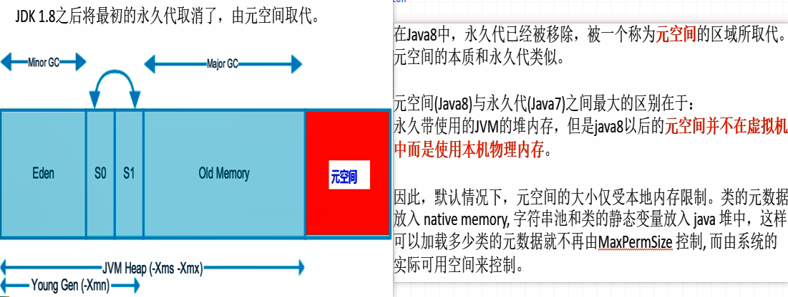

```java
public static void main(String[] args) {
    // JVM 内存容量
    long totalMemory = Runtime.getRuntime().totalMemory();
    // JVM 允许使用的最大容量
    long maxMemory = Runtime.getRuntime().maxMemory();

    System.out.println("TOTAL_MEMORY(-Xms) = " + totalMemory + "(字节) " + (totalMemory / 1024 / 1024) + " MB");
    System.out.println("MAX_MEMORY(-Xmx) = " + maxMemory + "(字节) " + (maxMemory / 1024 / 1024) + " MB");
    
    // TOTAL_MEMORY(-Xms) = 255328256(字节) 243 MB
    // MAX_MEMORY(-Xmx) = 3782737920(字节) 3607 MB
}
```

- `-Xms`：默认物理内存的 64 分之一
- `-Xmx`：默认物理内存的 4 分之一

#### 2.2 常用参数

##### 2.2.1 -Xms

初始堆内存大小 -> 等价于 `-XX:InitialHeapSize`。

##### 2.2.2 -Xmx

最大堆内存大小 -> 等价于 `-XX:MaxHeapSize`。

##### 2.2.3 -Xss

> The default value depends on the platform.
>
> 平台不一样，默认值不一样，Linux/x64 下 默认为 1024k。

设置单个线程栈大小，一般默认 512k~1024k。 -> 等价于 `-XX:ThreadStackSize`

##### 2.2.4 -Xmn

> 年轻代:老年代 = 1:2

设置年轻代大小，一般不用修改。

##### 2.2.5 -XX:MetaspaceSize

设置元空间大小。

> 元空间的本质和永久代类似，都是**==对 JVM 规范中方法区的实现==**。
>
> 元空间和永久代最大的区别在于：
>
> ==元空间不在虚拟机中，而是使用本地内存。==因此默认情况下，元空间的大小仅受**本地内存**限制。

##### 2.2.6 -XX:+PrintGCDetails

打印 GC 详细日志。

```tex
[GC (Allocation Failure) [PSYoungGen: 1525K->504K(2560K)] 1525K->656K(9728K), 0.0025594 secs] [Times: user=0.00 sys=0.00, real=0.00 secs] 
[GC (Allocation Failure) [PSYoungGen: 504K->488K(2560K)] 656K->664K(9728K), 0.0044138 secs] [Times: user=0.00 sys=0.00, real=0.00 secs] 
[Full GC (Allocation Failure) [PSYoungGen: 488K->0K(2560K)] [ParOldGen: 176K->588K(7168K)] 664K->588K(9728K), [Metaspace: 3113K->3113K(1056768K)], 0.0050178 secs] [Times: user=0.00 sys=0.00, real=0.01 secs] 
[GC (Allocation Failure) [PSYoungGen: 0K->0K(2560K)] 588K->588K(9728K), 0.0007594 secs] [Times: user=0.00 sys=0.00, real=0.00 secs] 
[Full GC (Allocation Failure) [PSYoungGen: 0K->0K(2560K)] [ParOldGen: 588K->571K(7168K)] 588K->571K(9728K), [Metaspace: 3113K->3113K(1056768K)], 0.0056512 secs] [Times: user=0.00 sys=0.00, real=0.01 secs] 
Heap
 PSYoungGen      total 2560K, used 121K [0x00000000ffd00000, 0x0000000100000000, 0x0000000100000000)
  eden space 2048K, 5% used [0x00000000ffd00000,0x00000000ffd1e738,0x00000000fff00000)
  from space 512K, 0% used [0x00000000fff00000,0x00000000fff00000,0x00000000fff80000)
  to   space 512K, 0% used [0x00000000fff80000,0x00000000fff80000,0x0000000100000000)
 ParOldGen       total 7168K, used 571K [0x00000000ff600000, 0x00000000ffd00000, 0x00000000ffd00000)
  object space 7168K, 7% used [0x00000000ff600000,0x00000000ff68ede0,0x00000000ffd00000)
 Metaspace       used 3205K, capacity 4496K, committed 4864K, reserved 1056768K
  class space    used 347K, capacity 388K, committed 512K, reserved 1048576K
Exception in thread "main" java.lang.OutOfMemoryError: Java heap space
	at com.albrus.gc.AlbrusGC.main(AlbrusGC.java:6)
```

- GC：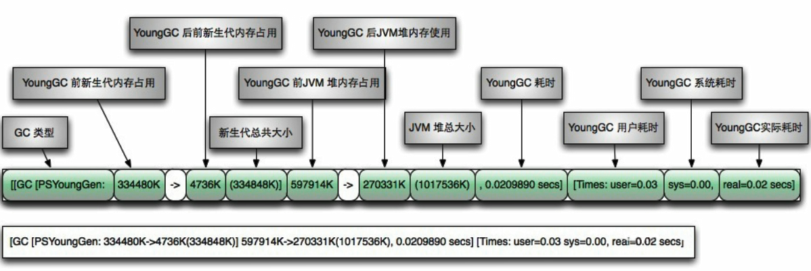
- Full GC 依次类推
- ==公式：[名称: GC 前内存占用 -> GC 后内存占用（该区总内存占用）] [] GC 前堆内存占用 -> GC 后堆内存占用（堆总大小）==

##### 2.2.7 -XX:SurvivorRatio

设置新生代中 Eden 区空间比例。

`-XX:SurvivorRatio=8`：Eden:S0:S1 = 8:1:1

```tex
// -XX:+PrintGCDetails
Heap
 PSYoungGen      total 2560K, used 1096K [0x00000000ffd00000, 0x0000000100000000, 0x0000000100000000)
  eden space 2048K, 29% used [0x00000000ffd00000,0x00000000ffd96238,0x00000000fff00000)
  from space 512K, 96% used [0x00000000fff00000,0x00000000fff7c040,0x00000000fff80000)
  to   space 512K, 0% used [0x00000000fff80000,0x00000000fff80000,0x0000000100000000)
 ParOldGen       total 7168K, used 468K [0x00000000ff600000, 0x00000000ffd00000, 0x00000000ffd00000)
  object space 7168K, 6% used [0x00000000ff600000,0x00000000ff675010,0x00000000ffd00000)
 Metaspace       used 3716K, capacity 4536K, committed 4864K, reserved 1056768K
  class space    used 409K, capacity 428K, committed 512K, reserved 1048576K
```

##### 2.2.8 -XX:NewRatio

甚至**新生代**和**老年代**在**堆**结构中的占比。

`-XX:NewRatio=4`：新生代 1，老年代 4 -> 新生代占堆 1/5，老年代占堆 4/5 -> **NewRatio 就是老年代的所占份数，新生代总是1**

##### 2.2.9 -XX:MaxTenuringThreshold

> ==JDK 8 中，MaxTenuringThreshold must be between 0 and 15.==，默认值：15。

设置垃圾最大年龄，存活超过多少代后转移到老年区。

- 设置较小，适用于老年代对象较多的情况，效率比较高，因为减少了在 Survivor 的复制
- 设置较大，年轻代对象会在 Survivor 区进行多次复制，增加年轻代存活时间，增加在年轻代即被回收的概率

### 番三 四大引用

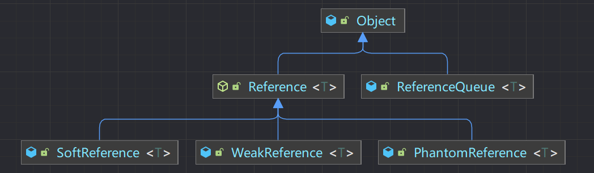

- `Reference`：强（默认）
- `SoftReference`：软
- `WeakReference`：弱
- `PhantomReference`：虚
- `ReferenceQueue`：引用队列

#### 3.1 强引用

`java.lang.ref.Reference`

对于强引用的对象，就算出现 OOM 异常，也不会对该对象进行回收。因此，强引用是造成 Java 内存泄漏的主要原因之一。

#### 3.2 软引用

`java.lang.ref.SoftReference`

对于软引用的对象，当系统内存不足时，将进行回收。例如：MyBatis 缓存就有用到软引用。

```java
/**
 * 故意生成大对象并配置小内存
 * -Xms5m -Xmx5m -XX:+PrintGCDetails
 */
private static void softReferenceMemoryNotEnough() {
    Object o1 = new Object();
    SoftReference<Object> softReference = new SoftReference<Object>(o1);
    System.out.println("o1: " + o1);
    System.out.println("softReference: " + softReference.get());

    o1 = null;

    try {
        byte[] bytes = new byte[10 * 1024 * 1024];
    } finally {
        System.out.println("o1: " + o1);
        System.out.println("softReference: " + softReference.get());
    }
}

// 输出：
/*
o1: java.lang.Object@4554617c
softReference: java.lang.Object@4554617c
o1: null
softReference: null
*/
```

#### 3.3 弱引用

`java.lang.ref.WeakReference`

不管内存够不够，GC 一律回收。

##### 3.3.1 ThreadLocal

`ThreadLocal` 中的 `Entry` 是使用 `WeakReference`：`static class Entry extends WeakReference<ThreadLocal<?>> {...}`。

那么这样做的好处呢？？

在 `Thread` 篇提到过，JDK 在底层设计 `ThreadLocal` 时是将 `ThreadLocalMap` 作为 `Thread` 的一个属性：`ThreadLocal.ThreadLocalMap threadLocals` 来设计的，这样更符合 `ThreadLocal` 的存在理念，而且当 `Thread` 消亡时，`ThreadLocalMap` 也会被回收。

那么 `Entry` 使用 `WeakReference` 的原因呢？

```java
static class ThreadLocalMap {
    static class Entry extends WeakReference<ThreadLocal<?>> {
        /** The value associated with this ThreadLocal. */
        Object value;

        Entry(ThreadLocal<?> k, Object v) {
            super(k);
            value = v;
        }
    }
}
```

- `ThreadLocal<?> k` 被软引用，Value 是强引用

  因此，`Entry` 软引用了 `ThreadLocal`，不管 `Entry` 是否存活，不影响 `ThreadLocal` 的生命周期。

  注意，这里是一个循环引用关系：

  - 当时线程创建 `ThreadLocal`
  - `Thread` 引用 `ThreadLocal.ThreadLocalMap`
  - `ThreadLocalMap` 引用 `Entry`
  - `Entry` 软引用 `ThreadLocal`

  **如果我即使在外面将 `ThreadLocal` 设置为 null 后（强引用消失），`ThreadLocal` 同样被 `Entry` 引用，如果不是软引用，`ThreadLocal` 不会被 GC，此时我们频繁的创建 `ThreadLocal` 对象，即使在栈中强引用消失，也会造成内存泄漏。**

- 但是 Value 是强引用

  因此，不清理掉 `Entry`，Value 会一直被强引用，造成内存泄漏，所以需要用完 `remove()`

##### 3.3.2 WeakHashMap

`java.util.WeakHashMap`

当 Key 消亡时，对应的 K-V Entry **在 GC 后**会被自动移除：

```java
private static void weakHashMap() {
    Map<Object, String> map = new WeakHashMap<>();
    Object key = new Object();
    map.put(key, "A");
    System.out.println(map);

    System.out.println("================ GC ================");

    key = null;
    System.gc();
    System.out.println(map);
}

// 输出：
/*
{java.lang.Object@14ae5a5=A}
================ GC ================
{}
*/
```

#### 3.4 虚引用

虚引用，又叫幽灵引用，`java.lang.ref.PhantomReference`

**形同虚设，虚引用不会决定对象的生命周期。**

如果一个对象仅只有虚引用，那么它就和没有任何引用一样，在任何时候都可能被垃圾回收器回收，**它也不能单独使用，也不能通过它来访问对象，必须和引用队列（`ReferenceQueue`）联合使用**，参见 `WeakHashMap`。

可以用来实现一些比 `finalization` 更灵活的回收操作。

**虚引用的主要作用是跟踪对象被垃圾回收的状态。**换句话说，设置虚引用关联的唯一目的，就是在这个对象被回收的时候会收到一个系统通知用于善后处理。

##### 3.4.1 ReferenceQueue

```java
public static void main(String[] args) {
    Object o1 = new Object();
    ReferenceQueue<Object> referenceQueue = new ReferenceQueue<>();
    WeakReference<Object> weakReference = new WeakReference<>(o1, referenceQueue);
    System.out.println("o1: " + o1);
    System.out.println("weakReference: " + weakReference.get());
    System.out.println("referenceQueue: " + referenceQueue.poll());

    System.out.println("================ GC ================");
    o1 = null;
    System.gc();

    System.out.println("o1: " + o1);
    System.out.println("weakReference: " + weakReference.get());
    System.out.println("referenceQueue: " + referenceQueue.poll());
}

// 输出：
/*
o1: java.lang.Object@677327b6
weakReference: java.lang.Object@677327b6
referenceQueue: null
================ GC ================
o1: null
weakReference: null
referenceQueue: java.lang.ref.WeakReference@14ae5a5
*/
```

- `ReferenceQueue` 是用来配合使用的

##### 3.4.2 PhantomReference

```java
public static void main(String[] args) {
    Object o1 = new Object();
    ReferenceQueue<Object> referenceQueue = new ReferenceQueue<>();
    PhantomReference<Object> phantomReference = new PhantomReference<>(o1, referenceQueue);
    System.out.println("o1: " + o1);
    System.out.println("phantomReference: " + phantomReference.get());
    System.out.println("referenceQueue: " + referenceQueue.poll());

    System.out.println("================ GC ================");
    o1 = null;
    System.gc();

    System.out.println("o1: " + o1);
    System.out.println("phantomReference: " + phantomReference.get());
    System.out.println("referenceQueue: " + referenceQueue.poll());
}

// 输出：
/*
o1: java.lang.Object@677327b6
phantomReference: null
referenceQueue: null
================ GC ================
o1: null
phantomReference: null
referenceQueue: java.lang.ref.PhantomReference@14ae5a5
*/
```

- 无法通过虚引用获取对象

- 当关联的引用队列有数据的时候，意味着堆内存中被引用的对象被回收

  通过这种方式 JVM 允许我们在对象被销毁后做一些我们自己的事情

- 可以用来实现一些比 `finalization` 更灵活的回收操作

### 番四 OOM

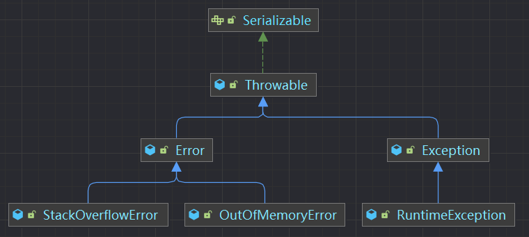

#### 4.1 SOFE - StackOverFlowError

递归调用。

#### 4.2 OOM

##### 4.2.1 Java heap space

大内存对象。

##### 4.2.2 GC overhead limit exceeded

GC 回收时间过长：超过 98% 的时间用来做 GC 但回收了不到 2% 的堆内存。

连续多次 GC 都只回收了不到 2% 的极端情况下才会抛出。如果不抛出异常，那么就会陷入频繁 GC 但效果极差且浪费 CPU 资源的恶性循环。

```java
/**
 * -Xms10m -Xmx10m -XX:+PrintGCDetails
 */
public static void main(String[] args) {
    int i = 0;
    List<String> list = new ArrayList<>();

    while (!Thread.currentThread().isInterrupted()) {
        list.add(String.valueOf(i++).intern());
    }
}

// 输出：
/*
...
[Full GC (Ergonomics) [PSYoungGen: 2047K->2047K(2560K)] [ParOldGen: 7064K->7064K(7168K)] 9112K->9112K(9728K), [Metaspace: 3240K->3240K(1056768K)], 0.0306544 secs] [Times: user=0.08 sys=0.00, real=0.03 secs] 
[Full GC (Ergonomics) [PSYoungGen: 2047K->2047K(2560K)] [ParOldGen: 7066K->7066K(7168K)] 9114K->9114K(9728K), [Metaspace: 3240K->3240K(1056768K)], 0.0326245 secs] [Times: user=0.11 sys=0.00, real=0.03 secs] 
[Full GC (Ergonomics) [PSYoungGen: 2047K->2047K(2560K)] [ParOldGen: 7069K->7067K(7168K)] 9117K->9115K(9728K), [Metaspace: 3243K->3243K(1056768K)], 0.0285083 secs] [Times: user=0.08 sys=0.00, real=0.03 secs] 
[Full GC (Ergonomics) [PSYoungGen: 2047K->2047K(2560K)] [ParOldGen: 7093K->7093K(7168K)] 9141K->9141K(9728K), [Metaspace: 3243K->3243K(1056768K)], 0.0320207 secs] [Times: user=0.11 sys=0.00, real=0.03 secs] 
[Full GC (Ergonomics) [PSYoungGen: 2047K->2047K(2560K)] [ParOldGen: 7107K->7095K(7168K)] 9155K->9143K(9728K), [Metaspace: 3260K->3260K(1056768K)], 0.0335132 secs] [Times: user=0.17 sys=0.00, real=0.03 secs] 
[Full GC (Ergonomics) [PSYoungGen: 2047K->0K(2560K)] [ParOldGen: 7128K->637K(7168K)] 9176K->637K(9728K), [Metaspace: 3310K->3310K(1056768K)], 0.0048576 secs] [Times: user=0.00 sys=0.00, real=0.00 secs] 
Heap
 PSYoungGen      total 2560K, used 76K [0x00000000ffd00000, 0x0000000100000000, 0x0000000100000000)
  eden space 2048K, 3% used [0x00000000ffd00000,0x00000000ffd13350,0x00000000fff00000)
  from space 512K, 0% used [0x00000000fff80000,0x00000000fff80000,0x0000000100000000)
  to   space 512K, 0% used [0x00000000fff00000,0x00000000fff00000,0x00000000fff80000)
 ParOldGen       total 7168K, used 637K [0x00000000ff600000, 0x00000000ffd00000, 0x00000000ffd00000)
  object space 7168K, 8% used [0x00000000ff600000,0x00000000ff69f6c0,0x00000000ffd00000)
 Metaspace       used 3351K, capacity 4496K, committed 4864K, reserved 1056768K
  class space    used 360K, capacity 388K, committed 512K, reserved 1048576K
Exception in thread "main" java.lang.OutOfMemoryError: GC overhead limit exceeded
	at java.lang.Integer.toString(Integer.java:403)
	at java.lang.String.valueOf(String.java:3099)
	at com.albrus.gc.AlbrusOverHeadGC.main(AlbrusOverHeadGC.java:16)

Process finished with exit code 1
*/
```

##### 4.2.3 Direct buffer memory

NIO 程序经常使用 `ByteBuffer` 来读取或者写入数据，这是一种基于通道（`Channel`）于缓冲区（`Buffer`）的 I/O 方式，它可以**使用 Native 函数库直接分配堆外内存**然后通过一个存储在 Java 堆里面的 `DirectByteBuffer` 对象作为这块内存的引用进行操作。这样**避免了在 Java 堆和 Native 堆中来回拷贝数据**，提高了性能。

- `ByteBuffer.allocate(capacity)`

  **在 JVM 堆内存**中分配，属于 GC 管辖范围，需要拷贝数据

- `ByteBuffer.allocateDirect(capacity)`

  **在 JVM 堆外**分配，不属于 GC 管辖范围，不需要拷贝数据

如果**不断分配本地内存，堆内存占用很少**，那么 JVM 就不会执行 GC，而 DirectByteBuffer 也不会被回收。此时堆内存充足，但本地内存不足，就会产生 `java.lang.OutOfMemoryError: Direct buffer memory`：

```java
/**
 * -Xms10m -Xmx10m -XX:MaxDirectMemorySize=5m
 */
public static void main(String[] args) {
    System.out.println("Max Direct Memory Size: " + sun.misc.VM.maxDirectMemory() / 1024 / 1024 + "MB.");
    
    List<ByteBuffer> list = new ArrayList<>();
    while (true) {
        list.add(ByteBuffer.allocateDirect(1 * 1024 * 1024));
    }
}

// 输出：
/*
Max Direct Memory Size: 5MB.
Exception in thread "main" java.lang.OutOfMemoryError: Direct buffer memory
	at java.nio.Bits.reserveMemory(Bits.java:694)
	at java.nio.DirectByteBuffer.<init>(DirectByteBuffer.java:123)
	at java.nio.ByteBuffer.allocateDirect(ByteBuffer.java:311)
	at com.albrus.gc.AlbrusDirectBufferMemory.main(AlbrusDirectBufferMemory.java:15)
*/
```

##### 4.2.4 unable to create new native thread

`unable to create new native thread` 异常与**对应的平台有关**：

- 应用程序创建了太多的线程，超过系统极限

- 服务器不允许应用程序创建那么多的线程，Linux 系统默认允许单个进程可以创建 1024 个线程

**解决方案：**

- 应用程序是否有必要创建那么多线程
- 调整服务器配置上限

```java
public static void main(String[] args) {
    for (int i = 0; ; i++) {
        new Thread(() -> {
            try {
                Thread.sleep(Integer.MAX_VALUE);
            } catch (InterruptedException e) {
                throw new RuntimeException(e);
            }
        }, i + "").start();
    }
}
// 输出：
/*
An unrecoverable stack overflow has occurred.
#
# A fatal error has been detected by the Java Runtime Environment:
#
#  EXCEPTION_STACK_OVERFLOW (0xc00000fd) at pc=0x0000000058094d37, pid=14028, tid=0x00000000000d9c74
#
# JRE version: Java(TM) SE Runtime Environment (8.0_191-b12) (build 1.8.0_191-b12)
# Java VM: Java HotSpot(TM) 64-Bit Server VM (25.191-b12 mixed mode windows-amd64 compressed oops)
# Problematic frame:
# An unrecoverable stack overflow has occurred.
[thread 892060 also had an error]
VException in thread "main" java.lang.OutOfMemoryError: unable to create new native thread
	at java.lang.Thread.start0(Native Method)
	at java.lang.Thread.start(Thread.java:717)
	at com.albrus.gc.AlbrusUnableCreateNativeThread.main(AlbrusUnableCreateNativeThread.java:13)

Process finished with exit code -1073741571 (0xC00000FD)
*/
```

##### 4.2.5 Metaspace

JDK 8 中元空间取代了永久代，并且 Metaspace 并不在虚拟机内存中而是使用本地内存，被存储在叫做 Metaspace 的 native memory（class metadata(the virtual machines internal presentation of Java class)）。

存放以下信息：

- 虚拟机加载的类信息
- 常量池
- 静态变量
- 即时编译后的代码

```java
/**
 * -XX:MetaspaceSize=10M -XX:MaxMetaspaceSize=10M
 */
public static void main(String[] args) {
    Enhancer enhancer = new Enhancer();
    enhancer.setSuperclass(Object.class);
    enhancer.setUseCache(false);
    enhancer.setCallback((MethodInterceptor) (o, method, objects, methodProxy) -> methodProxy.invokeSuper(o, objects));

    while (true) {
        enhancer.create();
    }
}

// 输出：
/*
Exception in thread "main" java.lang.OutOfMemoryError: Metaspace
	at net.sf.cglib.core.AbstractClassGenerator.generate(AbstractClassGenerator.java:348)
	at net.sf.cglib.proxy.Enhancer.generate(Enhancer.java:492)
	at net.sf.cglib.core.AbstractClassGenerator$ClassLoaderData.get(AbstractClassGenerator.java:117)
	at net.sf.cglib.core.AbstractClassGenerator.create(AbstractClassGenerator.java:294)
	at net.sf.cglib.proxy.Enhancer.createHelper(Enhancer.java:480)
	at net.sf.cglib.proxy.Enhancer.create(Enhancer.java:305)
	at com.albrus.gc.AlbrusMetaspace.main(AlbrusMetaspace.java:21)
*/
```

- JDK 7 中异常信息为：`java.lang.OutOfMemoryError: PermGen space`
- ` -XX:MaxMetaspaceSize`：元空间最大值。默认是-1，即只受限于本地内存大小。
- `-XX:MetaspaceSize`：元空间初始大小，以字节为单位，达到该值将触发垃圾收集进行类型卸载，同时收集器会对该值进行调整：如果释放了大量的空间，就适当降低该值；否则，再不超过 ` -XX:MaxMetaspaceSize` 的情况下（如果有设置），适当提高该值。
- ` -XX:MiniMetaspaceFreeRatio`：在垃圾收集之后控制最小的元空间剩余容量的百分比，可减少因为元空间不足导致的垃圾收集频率。类型的还有 `-XX:Max-MetaspaceFreeRatio`，用于控制最大的元空间剩余容量的百分比。

### 番五 垃圾回收器

#### 5.1 垃圾回收器种类

**四大垃圾回收算法：**

1. 引用计数
2. 复制拷贝 - 浪费空间
3. 标记、清除 - 碎片化
4. 标记、整理 - 性能较差

**四大垃圾回收器：**

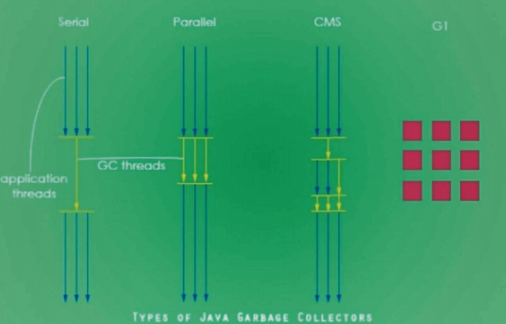

1. Serial - 串行垃圾回收器

   会中断（暂停）业务线程执行，一个 GC 线程工作

2. Parallel - 并行垃圾回收器

   会中断（暂停）业务线程执行，多个 GC 线程工作，适用于前台交互较弱的场景，例如科学计算、大数据处理

3. CMS - 并发垃圾回收器（ConcMarkSweep）

   **并发标记清除**，用户线程和 GC 线程同时执行（不一定是并行，可能交替执行），不需要停顿用户线程，适用于对响应时间有要求的场景

4. G1

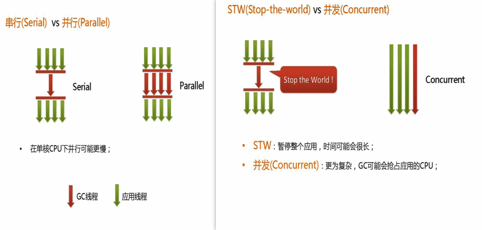

**算法 & 回收器：**

垃圾回收算法是方法论，回收器是对算法的落地实现。

到目前为止还没有完美的收集器出现，更加没有完美的收集器，只是针对**具体应用**采用最合适的垃圾收集器，进行**分代**收集。

#### 5.2 JVM 默认垃圾回收器

##### 5.2.1 查看默认垃圾回收器

`java -XX:+PrintCommandLineFlags -version`

```bash
PS E:\Workspace\IntelliJ IDEA\Albrus-JVM> java -XX:+PrintCommandLineFlags -version
-XX:InitialHeapSize=265865728 -XX:MaxHeapSize=4253851648 -XX:+PrintCommandLineFlags -XX:+UseCompressedClassPointers -XX:+UseCompressedOops -XX:-UseLargePagesIndividualAllocation -XX:+UseParallelGC 
java version "1.8.0_191"
Java(TM) SE Runtime Environment (build 1.8.0_191-b12)
Java HotSpot(TM) 64-Bit Server VM (build 25.191-b12, mixed mode)
```

- **`-XX:+UseParallelGC `**

`jinfo -flag UseParallelGC pid`

##### 5.2.2 默认垃圾回收器

> https://docs.oracle.com/javase/8/docs/technotes/guides/vm/gctuning/
>
> **Selecting a Collector**
>
> Unless your application has rather strict pause time requirements, first run your application and allow the VM to select a collector.
>
> If necessary, adjust the heap size to improve performance. If the performance still does not meet your goals, then use the following guidelines as a starting point for selecting a collector:
>
> - If the application has a small data set (up to approximately 100 MB), thenselect the serial collector with the option `-XX:+UseSerialGC`.
> - If the application will be run on a single processor and there are no pause time requirements, then let the VM select the collector, or select the serial collector with the option `-XX:+UseSerialGC`.
> - If (a) peak application performance is the first priority and (b) there are no pause time requirements or pauses of 1 second or longer are acceptable, then let the VM select the collector, or select the parallel collector with `-XX:+UseParallelGC`.
> - If response time is more important than overall throughput and garbage collection pauses must be kept shorter than approximately 1 second, then select the concurrent collector with `-XX:+UseConcMarkSweepGC` or `-XX:+UseG1GC`.
>
> https://docs.oracle.com/en/java/javase/18/gctuning/introduction-garbage-collection-tuning.html
>
> **Selecting a Collector**
>
> Unless your application has rather strict pause-time requirements, first run your application and allow the VM to select a collector.
>
> If necessary, adjust the heap size to improve performance. If the performance still doesn't meet your goals, then use the following guidelines as a starting point for selecting a collector:
>
> - If the application has a small data set (up to approximately 100 MB), then select the serial collector with the option `-XX:+UseSerialGC`.
> - If the application will be run on a single processor and there are no pause-time requirements, then select the serial collector with the option `-XX:+UseSerialGC`.
> - If (a) peak application performance is the first priority and (b) there are no pause-time requirements or pauses of one second or longer are acceptable, then let the VM select the collector or select the parallel collector with `-XX:+UseParallelGC`.
> - If response time is more important than overall throughput and garbage collection pauses must be kept shorter, then select the mostly concurrent collector with `-XX:+UseG1GC`.
> - If response time is a high priority, then select a fully concurrent collector with `-XX:UseZGC`.

`UseSerialGC`、`UseParallelGC`、`UseConcMarkSweepGC`、`UseParNewGC`、`UseParallelOldGC`、`UseG1GC`

`UseSerialOldGC` - 已废弃

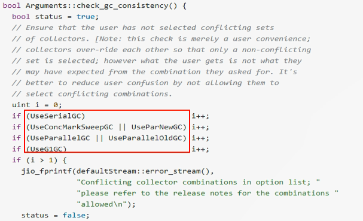

##### 5.2.3 ==可以看出组合关系==

1. Serial
2. CMS + ParNew
3. Parallel + ParallelOld
4. GC

```tex
Young				Tenured			JVM options
Serial				Serial			-XX:+UseSerialGC
Parallel Scavenge	Serial			-XX:+UseParallelGC -XX:-UseParallelOldGC
Parallel New		Serial			-XX:+UseParNewGC
Serial				Parallel Old	N/A
Parallel Scavenge	Parallel Old	-XX:+UseParallelGC -XX:+UseParallelOldGC
Parallel New		Parallel Old	N/A
Serial				CMS				-XX:-UseParNewGC -XX:+UseConcMarkSweepGC
Parallel Scavenge	CMS				N/A
Parallel New		CMS				-XX:+UseParNewGC -XX:+UseConcMarkSweepGC
G1									-XX:+UseG1GC
```

- PS：**UseConcMarkSweepGC is "ParNew" + "CMS" + "Serial Old"**. "CMS" is used most of the time to collect the tenured generation. **=="Serial Old" is used when a concurrent mode failure occurs.==** 

- **JDK 8 默认的垃圾回收器**是 `-XX:+UseParallelGC` 和 `-XX:+UseParallelOldGC`，如果内存较大(超过 4G)，系统对**停顿时间**比较敏感，我们可以使用 ParNew + CMS(`-XX:+UseParNewGC -XX:+UseConcMarkSweepGC`)

- "ParNew" is a stop-the-world, **copying collector** which uses multiple GC threads. **It differs from "Parallel Scavenge" in that it has enhancements that make it usable with CMS.** For example, "ParNew" does the synchronization needed so that it can run during the concurrent phases of CMS.

- Parallel Scavenge 收集器关注点是吞吐量（高效率的利用 CPU），CMS 等垃圾收集器的关注点更多的是用户线程的停顿时间（提高用户体验）。

  所谓吞吐量就是 CPU 中用于运行用户代码的时间与 CPU 总消耗时间的比值。 Parallel Scavenge 收集器提供了很多参数供用户找到最合适的停顿时间或最大吞吐量，如果对于收集器运作不太了解的话，可以选择把内存管理优化交给虚拟机去完成也是一个不错的选择。

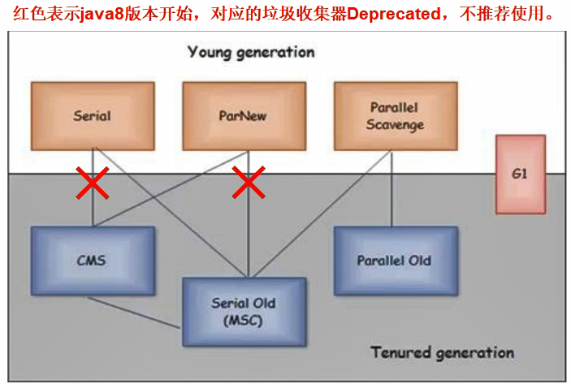

- **配置新生代收集器后，对应连线老年代收集器自动激活**

#### 5.3 七大垃圾回收器

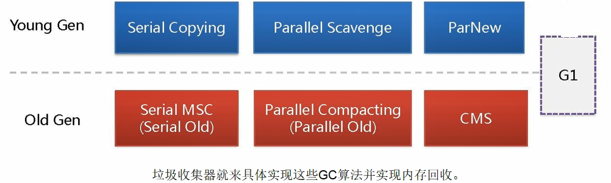

##### 5.3.1 GC 约定参数

- DefNew - Default New Generation
- Tenured - Old
- ParNew - Parallel New Generation
- PSYoungGen - Parallel Scavenge
- ParOldGen - Parallel Old Generation

##### 5.3.2 Server/Client 模式

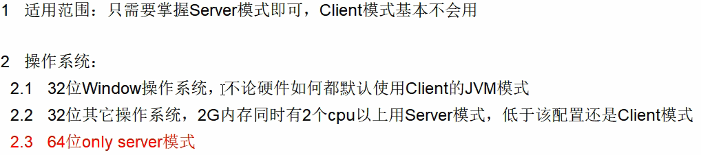

##### 5.3.3 Serial/Serial Copying

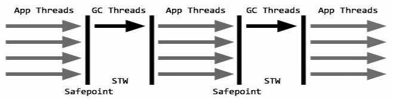

单线程**新生代**垃圾收集器，在进行垃圾回收时，必须暂停用户线程，但是简单、高效、稳定：`-XX:+UseSerialGC`。
**开启**后：`Serial + Serial Old`，**新生代使用复制算法、老年代使用标记整理算法**。

##### 5.3.4 ParNew

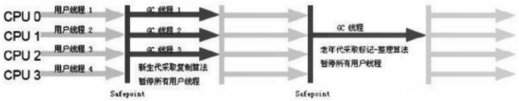

Serial 的并行多线程版本，也是属于**新生代**垃圾收集器，**与 Parallel Scavenge 不同的是，ParNew 可以与 CMS 搭配使用**，`-XX:+UseParNewGC`。
**开启**后：`ParNew + Serial Old`，只影响新生代，不影响老年代，**新生代使用复制算法、老年代使用标记整理算法**。

:red_circle:`-XX:+UseParNewGC`：在 JDK 8 版本，已经**不推荐**使用了：Java HotSpot(TM) 64-Bit Server VM warning: Using the ParNew young collector with the Serial old collector is deprecated and will likely be removed in a future release 

:red_circle:`-XX:ParallelGCThreads=n`：限制线程数量，默认开启和 CPU 相同数目的线程数

##### 5.3.5 Parallel/Parallel Scavenge

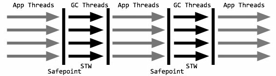

新生代和老年代都使用并行多线程的垃圾收集器，使用复制算法，俗称**吞吐量优先收集器**，`-XX:+UseParallelGC/-XX:+UseParallelOldGC`（可互相激活）。
**开启**后：**新生代使用复制算法、老年代使用标记整理算法**。

:red_circle:`-XX:ParallelGCThreads=n`：限制线程数量，默认开启和 CPU 相同数目的线程数

与 ParNew 的区别：

- 可控制的吞吐量

  Thoughput=运行用户代码时间/（运行用户代码时间+垃圾收集时间），99/(99+1)=99% 吞吐量。高吞吐量适合高效利用 CPU 时间型任务：后台运算等不需要太多交互的任务

- 自适应调节策略

  虚拟机会根据当前系统的运行情况收集性能监控信息，动态调整参数以提供最合适的停顿时间（`-XX:MaxGCPauseMillis`）或最大吞吐量

##### 5.3.6 Parallel Old

Parallel Old 是 Parallel 的**老年代**版本，使用**标记整理算法**，在 JDK 6 才开始提供。
在 JDK 6 以前，新生代的 Parallel Scavenge 只能与 Serial Old 搭配。
`-XX:+UseParallelGC/-XX:+UseParallelOldGC`（可互相激活）。

##### 5.3.7 CMS

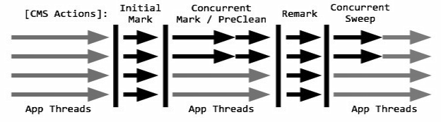

`Concurrent Mark Sweep` 是一种适用于**老年代的==并发==标记清除算法**，是一种以获取**最短回收暂停时间**为目标的收集器。
适合于互联网等B/S架构的服务器上以争取最快的响应速度，CMS 非常适合堆内存大、CPU 核数多的服务器端应用，也是 G1 出现前大型应用首选收集器。
并发：垃圾回收线程可以与用户线程并发执行。

**开启**后：`-XX:+UseConcMarkSweepGC`，会自动激活 `-XX:+UseParNewGC`，使用 `ParNew + CMS + Serial Old` 的收集组合（**Serial Old 作为 CMS 收集出错后的后备收集器**）：

```bash
[GC (CMS Initial Mark) [1 CMS-initial-mark: 6758K(6848K)] 8806K(9920K), 0.0000949 secs] [Times: user=0.00 sys=0.00, real=0.00 secs] 
[CMS-concurrent-mark-start]
[CMS-concurrent-mark: 0.001/0.001 secs] [Times: user=0.00 sys=0.00, real=0.00 secs] 
[CMS-concurrent-preclean-start]
[CMS-concurrent-preclean: 0.000/0.000 secs] [Times: user=0.00 sys=0.00, real=0.00 secs] 
[CMS-concurrent-abortable-preclean-start]
[CMS-concurrent-abortable-preclean: 0.000/0.000 secs] [Times: user=0.00 sys=0.00, real=0.00 secs] 
[GC (CMS Final Remark) [YG occupancy: 2152 K (3072 K)][Rescan (parallel) , 0.0001254 secs][weak refs processing, 0.0000078 secs][class unloading, 0.0001434 secs][scrub symbol table, 0.0002629 secs][scrub string table, 0.0000819 secs][1 CMS-remark: 6758K(6848K)] 8911K(9920K), 0.0006574 secs] [Times: user=0.00 sys=0.00, real=0.00 secs] 
[CMS-concurrent-sweep-start]

[Full GC (System.gc()) [CMS: 0K->607K(173440K), 0.0249183 secs] 2775K->607K(251456K), [Metaspace: 3192K->3192K(1056768K)], 0.0250132 secs] [Times: user=0.01 sys=0.02, real=0.03 secs] 
Heap
 par new generation   total 78144K, used 3475K [0x00000006c2600000, 0x00000006c7ac0000, 0x00000006e1930000)
  eden space 69504K,   5% used [0x00000006c2600000, 0x00000006c2964e60, 0x00000006c69e0000)
  from space 8640K,   0% used [0x00000006c69e0000, 0x00000006c69e0000, 0x00000006c7250000)
  to   space 8640K,   0% used [0x00000006c7250000, 0x00000006c7250000, 0x00000006c7ac0000)
 concurrent mark-sweep generation total 173440K, used 607K [0x00000006e1930000, 0x00000006ec290000, 0x00000007c0000000)
 Metaspace       used 3206K, capacity 4496K, committed 4864K, reserved 1056768K
  class space    used 347K, capacity 388K, committed 512K, reserved 1048576K
```

- par new generation 
- concurrent mark-sweep generation

**四个阶段：**

1. 初始标记（Initial Mark）

   STW，标记一下 GC Roots 能直接关联的对象，速度很快

2. 并发标记（Concurrent Mark / PreClean）

   进行 GC Roots 跟踪的过程，和用户线程并发执行（**主要标记过程，标记全部对象**）。

3. 重新标记（Remark）

   STW，修正在“并发标记”阶段，因用户线程继续运行导致标记有变动，有变动那一部分对象需要重新扫描（如果不 STW，那么陷入死胡同永远停不下来进行清除）。

4. 并发清除（Concurrent Sweep）

   清除 GC Roots 不可达对象，可用户线程并发执行。由于最耗时的是**并发标记**和**并发清除**过程，这两大过程都是并发执行，因此从总体来看，CMS 收集器的内存回收是与用户线程并发执行。

**优缺点：**

- （优）并发收集，低 STW

- （缺）并发执行，对 CPU 压力大

  由于**并发**执行，CMS 在收集时与用户线程会**增加对堆内存的占用**。也就是说，CMS 必须要在**老年代堆内存用完之前完成垃圾回收**，否则 CMS 回收失败会触发**担保机制**采用 Serial Old 进行一次 GC，需要**较大停顿时间**

- （却）标记清除算法，会导致大量碎片

  `-XX:CMSFullGCsBeForeCompaction=0(Default: 每次都进行内存整理)`：指定多少次 CMS 收集之后进行一次压缩的 FULL GC

##### 5.3.8 Serial Old

Serial Old 是 Serial 的**老年代**版本，使用**标记整理算法**，JDK 8 不能显示指定使用该收集器。
在 Server 模式，主要有两个用途：

1. （JDK 5）搭配新生代 Parallel Scavenge 收集器使用（Parallel Scanenge + Serial Old）
2. **（JDK 8）作为 CMS 收集器的后背垃圾收集方案**

##### 5.3.9 G1

`-XX:+UseG1GC`

`-XX:G1HeapRegionSize`：分区大小，1~32MB，2 的幂

`-XX:MaxGCPauseMillis=n`：最大 GC 停顿时间（期望值，不保证）

```java
Heap
 garbage-first heap   total 10240K, used 4700K [0x00000000ff600000, 0x00000000ff700050, 0x0000000100000000)
  region size 1024K, 1 young (1024K), 0 survivors (0K)
 Metaspace       used 3246K, capacity 4496K, committed 4864K, reserved 1056768K
  class space    used 352K, capacity 388K, committed 512K, reserved 1048576K
```

- 充分利用多核 CPU，尽量**缩短 STW**
- 整体上采用**标记整理**算法，局部通过**复制**算法，==减少内存碎片产生====**（与 CMS 的最大区别）**==
- 宏观上 G1 不再区分年轻代和老年代：**把内存划分为多个大小相同且独立的子区域（Region）**
- 其本身依然在**小范围**内进行年轻代和老年代的区分，保留新生代和老年代
- 虽然也是分代收集器，但整个内存**不存在物理上的年轻代和老年代区别，也不需要完全独立的 Survivor(to) 堆做复制准备**。G1 只**在逻辑上有分代概念**，或者说每个分区都可能随着 G1 的运行而切换角色
- 添加了**停顿时间预测机制**，==用户可以指定期望停顿时间==**（与 CMS 的第二个区别）**

==小区域收集 + 形成连续内存块 -> 解决内存碎片问题==

**出现时间：**

G1 在 2012 年的 JDK 1.7u4 中可用，**Oracle 在 JDK 9 中将 G1 变成默认的垃圾收集器以替代 CMS**。
是一款面向服务端应用的收集器，应用在多核 + 大内存环境下，极大减少垃圾收集停顿时间。

主要改变是 Eden、Survivor 和 Tenured 内存区域不再是连续的了，而是变为一个个大小相同的独立 Region 区。

**底层原理：**

**将整个堆内存划分为多个大小相同且独立的子区域（Region）**，在 JVM 启动时会自动设置这些子区域的大小。

在堆的使用上，G1 不要求对象的存储一定是物理上连续的，只要逻辑上连续即可，每个分区也不会固定地为某个代服务，可以按需在年轻代和老年代之间切换。

启动时，通过参数 `-XX:G1HeapRegionSize=n` 指定分区大小（1~32MB，必须是 2 的幂），默认将堆划分为 2048 个分区 -> 最大内存：32 * 2048 = 64G。

**Region 分代：**

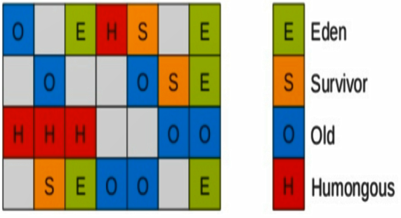

- Eden

- Survivor

- Old

- Humongous：超大对象

  如果一个对象占用超过分区的 50%，就会被分配到 Humongous 区（直接分配到老年区的话，如果是一个短暂对象，将带来负面影响）
  如果一个 H 区装不下，G1 会寻找连续的 H 区来存放，有时不得不 Gull GC 以找到连续的 H 区

**收集：**

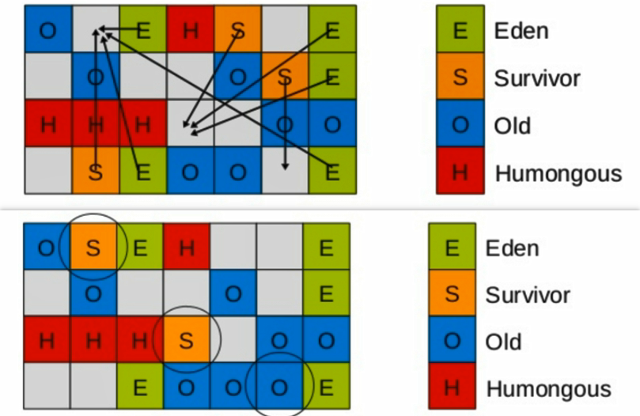

- ==小区域收集 + 形成连续内存块 -> 解决内存碎片问题==

  将对象从一个区域复制到另一个区域完成清理工作，减少内存碎片

**四个阶段：**

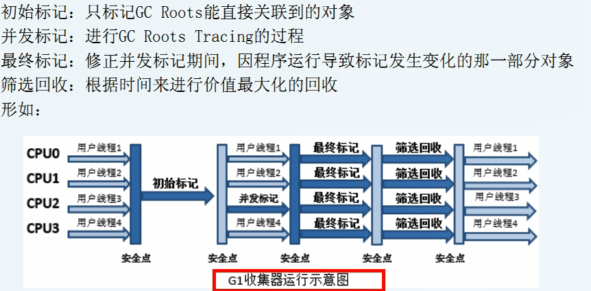

##### 5.3.10 CMS 补充强化

CMS（Concurrent Mark Sweep）收集器是一种以获取最短回收停顿时间为目标的收集器。它非常符合在注重用户体验的应用上使用，它是 HotSpot 虚拟机第一款真正意义上的并发收集器，它第一次实现了让垃圾收集线程与用户线程（基本上）同时工作。
从名字中的 Mark Sweep 这两个词可以看出，CMS收集器是一种 “标记-清除”算法实现的，它的运作过程相比于前面几种垃圾收集器来说更加复杂一些。整个过程分为四个步骤：

1. 初始标记： 暂停所有的其他线程(STW)，并记录下 GC Roots 直接能引用的对象，速度很快。
2. 并发标记： 并发标记阶段就是从 GC Roots 的直接关联对象开始遍历整个对象图的过程， 这个过程耗时较长但是不需要停顿用户线程， 可以与垃圾收集线程一起并发运行。因为用户程序继续运行，可能会有导致已经标记过的对象状态发生改变。
3. 重新标记： 重新标记阶段就是为了修正并发标记期间因为用户程序继续运行而导致标记产生变动的那一部分对象的标记记录，这个阶段的停顿时间一般会比初始标记阶段的时间稍长，远远比并发标记阶段时间短。主要用到三色标记里的增量更新算法(见下面详解)做重新标记。
4. 并发清理： 开启用户线程，同时 GC 线程开始对未标记的区域做清扫。这个阶段如果有新增对象会被标记为黑色不做任何处理(见下面三色标记算法详解)。
   **并发重置：**重置本次 GC 过程中的标记数据。

从它的名字就可以看出它是一款优秀的垃圾收集器，主要优点：并发收集、低停顿。但是它有下面几个明显的缺点：

- 对CPU资源敏感（会和服务抢资源）；
- 无法处理浮动垃圾(在并发标记和并发清理阶段又产生垃圾，这种浮动垃圾只能等到下一次gc再清理了)；
- 它使用的回收算法 - “标记-清除”算法，会导致收集结束时会有**大量碎片产生**，当然通过参数 `-XX:+UseCMSCompactAtFullCollection` 可以让 JVM 在执行完**标记清除后再做整理**
- 执行过程中的**不确定性**，会存在上一次垃圾回收还没执行完，然后垃圾回收又被触发的情况，特别是在并发标记和并发清理阶段会出现，一边回收，系统一边运行，也许没回收完就再次触发 FULL GC，也就是"concurrent mode failure"，此时会进入 stop the world，用 Serial Old 垃圾收集器来回收

CMS的相关核心参数：

- `-XX:+UseConcMarkSweepGC`：启用 CMS
- `-XX:ConcGCThreads`：并发的 GC 线程数
- `-XX:+UseCMSCompactAtFullCollection`：Full GC 之后做压缩整理（减少碎片）
- `-XX:CMSFullGCsBeforeCompaction`：多少次 Full GC 之后压缩一次，默认是 0，代表每次 Full GC 后都会压缩一次
- `-XX:CMSInitiatingOccupancyFraction`: 当老年代使用达到该比例时会触发 Full GC（默认是92，这是百分比）
- `-XX:+UseCMSInitiatingOccupancyOnly`：只使用设定的回收阈值(`-XX:CMSInitiatingOccupancyFraction` 设定的值)，如果不指定，JVM仅在第一次使用设定值，后续则会自动调整
- `-XX:+CMSScavengeBeforeRemark`：在 CMS GC 前启动一次 minor gc，目的在于减少老年代对年轻代的引用，**降低 CMS GC 的标记阶段时的开销**，一般 CMS 的 GC 耗时 80% 都在标记阶段
- `-XX:+CMSParallellnitialMarkEnabled`：表示在初始标记的时候多线程执行，缩短 STW
- `-XX:+CMSParallelRemarkEnabled`：在重新标记的时候多线程执行，缩短 STW

##### 5.3.11 实战：亿级流量电商系统如何优化JVM参数设置(ParNew + CMS)

大型电商系统后端现在一般都是拆分为多个子系统部署的，比如，商品系统，库存系统，订单系统，促销系统，会员系统等等。

以核心的订单系统为例，如下：

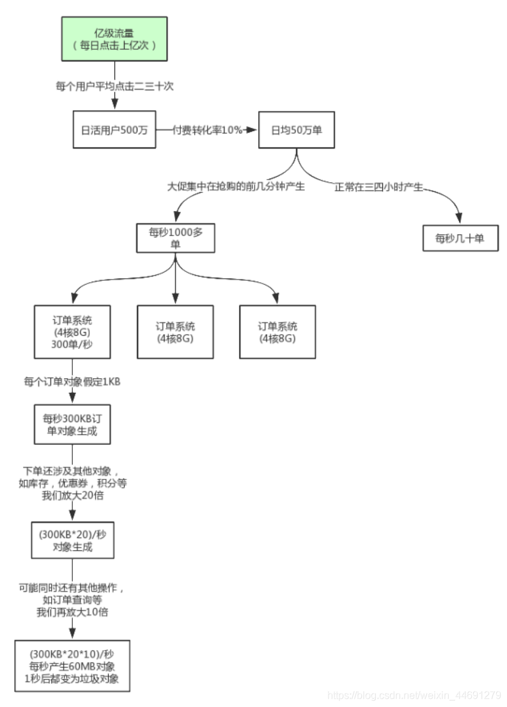

对于 8G 内存，我们一般是分配 4G 内存给 JVM，正常的 JVM 参数配置：
`-Xms3072M -Xmx3072M -Xss1M -XX:MetaspaceSize=256M -XX:MaxMetaspaceSize=256M -XX:SurvivorRatio=8`

这样设置可能会由于动态对象年龄判断原则导致频繁 FULL GC，于是我们可以更新下JVM参数设置（**调整新生代大小**）：
`-Xms3072M -Xmx3072M -Xmn2048M -Xss1M -XX:MetaspaceSize=256M -XX:MaxMetaspaceSize=256M -XX:SurvivorRatio=8`

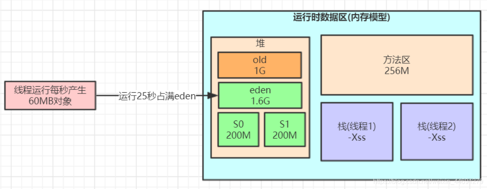

这样就降低了因为对象动态年龄判断原则导致的对象频繁进入老年代的问题，**其实很多优化无非就是让短期存活的对象尽量都留在 Survivor 里**，不要进入老年代，这样在 minor gc 的时候这些对象都会被回收，不会进到老年代从而导致 FULL GC。

对于对象年龄应该为多少才移动到老年代比较合适，本例中一次 minor gc 要间隔二三十秒，大多数对象一般在几秒内就会变为垃圾，完全可以将默认的 15 岁改小一点，比如改为 5，那么意味着对象要经过 5 次 minor gc 才会进入老年代，整个时间也有一两分钟了，如果对象这么长时间都没被回收，完全可以认为这些对象是会存活的比较长的对象，可以移动到老年代，而不是继续一直占用 Survivor 区空间。
对于多大的对象直接进入老年代(参数 `-XX:PretenureSizeThreshold`)，这个一般可以结合你自己系统看下有没有什么大对象生成，预估下大对象的大小，一般来说设置为 1M 就差不多了，很少有超过 1M 的大对象，这些对象一般就是你系统初始化分配的缓存对象，比如大的缓存 `List`、`Map` 之类的对象。

可以适当调整JVM参数如下：
`-Xms3072M -Xmx3072M -Xmn2048M -Xss1M -XX:MetaspaceSize=256M -XX:MaxMetaspaceSize=256M -XX:SurvivorRatio=8 -XX:MaxTenuringThreshold=5 -XX:PretenureSizeThreshold=1M`

对于 JDK 8 默认的垃圾回收器是 `-XX:+UseParallelGC -XX:+UseParallelOldGC`，如果内存较大(超过 4G，只是经验值)，系统对停顿时间比较敏感，我们可以使用 ParNew + CMS(`-XX:+UseParNewGC -XX:+UseConcMarkSweepGC`)
对于老年代 CMS 的参数如何设置我们可以思考下，首先我们想下当前这个系统有哪些对象可能会长期存活躲过 5 次以上 minor gc 最终进入老年代：
无非就是**那些 Spring 容器里的 Bean**、**线程池对象**、**初始化缓存数据对象**等，这些加起来充其量也就几十 MB。
还有就是某次 minor gc 完了之后还有超过一两百 M 的对象存活，那么就会直接进入老年代，比如突然某一秒瞬间要处理五六百单，那么每秒生成的对象可能有一百多 M，再加上整个系统可能压力剧增，一个订单要好几秒才能处理完，下一秒可能又有很多订单过来。
我们可以估算下大概每隔五六分钟出现一次这样的情况，那么大概半小时到一小时之间就可能因为老年代满了触发一次 Full GC，Full GC 的触发条件还有我们之前说过的老年代空间分配担保机制，历次的 minor gc 挪动到老年代的对象大小肯定是非常小的，所以几乎不会在 minor gc 触发之前由于老年代空间分配担保失败而产生 FULL GC，其实在半小时后发生 FULL GC，这时候已经过了抢购的最高峰期，后续可能几小时才做一次 FULL GC。

对于碎片整理，因为都是 1 小时或几小时才做一次 FULL GC，是可以每做完一次就开始碎片整理，或者两到三次之后再做一次也行。
综上，只要年轻代参数设置合理，老年代 CMS 的参数设置基本都可以用默认值，如下所示：
`-Xms3072M -Xmx3072M -Xmn2048M -Xss1M -XX:MetaspaceSize=256M -XX:MaxMetaspaceSize=256M -XX:SurvivorRatio=8 -XX:MaxTenuringThreshold=5 -XX:PretenureSizeThreshold=1M -XX:+UseParNewGC -XX:+UseConcMarkSweepGC -XX:CMSInitiatingOccupancyFraction=92 -XX:+UseCMSCompactAtFullCollection -XX:CMSFullGCsBeforeCompaction=3`

##### 5.3.12 三色标记

在**并发**标记的过程中，因为标记期间应用线程还在继续跑，对象间的引用可能发生变化，**多标和漏标**的情况就有可能发生。
这里我们引入“三色标记”来给大家解释下，把 GC Roots 可达性分析遍历对象过程中遇到的对象， 按照“是否访问过”这个条件标记成以下三种颜色：

- **黑色**：表示对象已经被垃圾收集器访问过，且这个对象的所有引用都已经扫描过。黑色的对象代表已经扫描过，它是安全存活的，如果有其他对象引用指向了黑色对象，无须重新扫描一遍。黑色对象不可能直接（不经过灰色对象）指向某个白色对象。
- **灰色**：表示对象已经被垃圾收集器访问过，但这个对象上至少存在一个引用还没有被扫描过。
- **白色**：表示对象尚未被垃圾收集器访问过。显然在可达性分析刚刚开始的阶段，所有的对象都是白色的，若在分析结束的阶段，仍然是白色的对象，即代表不可达。

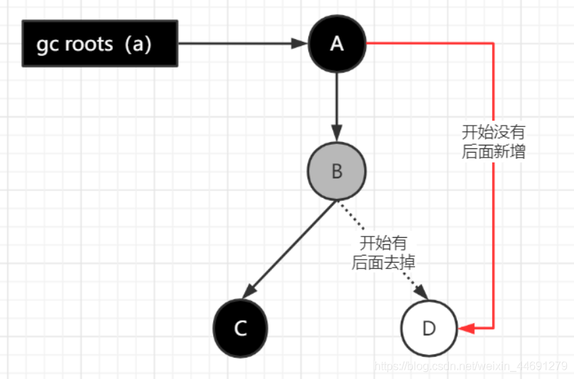

**多标 - 浮动垃圾**
在并发标记过程中，如果由于方法运行结束导致部分局部变量(GC Root)被销毁，这个 GC Root 引用的对象之前又被扫描过(被标记为非垃圾对象)，那么本轮 GC 不会回收这部分内存。

这部分本应该回收但是没有回收到的内存，被称之为“浮动垃圾”。浮动垃圾并不会影响垃圾回收的正确性，只是需要等到下一轮垃圾回收中才被清除。

另外，针对并发标记(还有并发清理)开始后产生的新对象，**通常的做法是直接全部当成黑色**，本轮不会进行清除。这部分对象期间可能也会变为垃圾，这也算是浮动垃圾的一部分。

假设已经遍历到 E（变为灰色了），此时应用执行了 objD.fieldE = null (D > E 的引用断开)

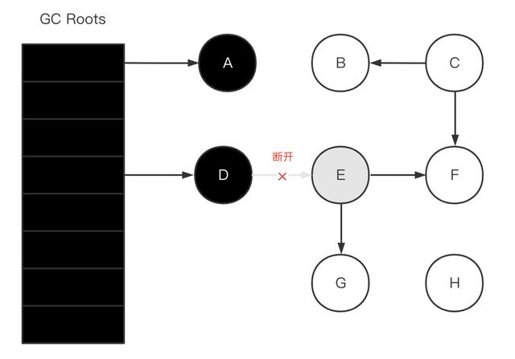

D > E 的引用断开之后，E、F、G 三个对象不可达，应该要被回收的。然而因为 E 已经变为灰色了，其仍会被当作存活对象继续遍历下去。最终的结果是：这部分对象仍会被标记为存活，即本轮 GC 不会回收这部分内存。

**漏标 - 读写屏障**
漏标会**导致被引用的对象被当成垃圾误删除**，这是严重 BUG，必须解决。

假设 GC 线程已经遍历到 E（变为灰色了），此时应用线程先执行了：

```c
var G = objE.fieldG; objE.fieldG = null; // 灰色E 断开引用 白色G 
objD.fieldG = G; // 黑色D 引用 白色G
```

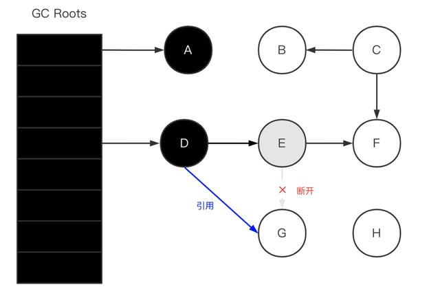

此时切回到 GC 线程，因为 E 已经没有对 G 的引用了，所以不会将 G 置为灰色；尽管因为 D 重新引用了 G，但因为 D 已经是黑色了，不会再重新做遍历处理。

最终导致的结果是：G 会一直是白色，最后被当作垃圾进行清除。这直接影响到了应用程序的正确性，是不可接受的。

**不难分析，漏标只有同时满足以下两个条件时才会发生：**

- 一个或者多个黑色对象重新引用了白色对象：即黑色对象成员变量增加了新的引用
- 灰色对象断开了白色对象的引用（直接或间接的引用）：即灰色对象原来成员变量的引用发生了变化

```c
var G = objE.fieldG; // 1.读
objE.fieldG = null; // 2.写
objD.fieldG = G; // 3.写
```

在上面三个步骤，我们只需要在任意一个步骤将对象 G 记录起来然后作为灰色对象再次进行遍历（重新标记）即可。

==重新标记是需要 STW 的，因为程序一直跑，那么集合中又会增加新的对象，永远都跑不完。所以，三色标记算法也只能**优化** STW 时间，不能彻底解决 STW 问题。并发标记期间将大量对象提前扫描了一次，减少（优化）了 STW 时间。==

有两种解决方案：

1. 增量更新（Incremental Update）

   增量更新就是当**黑色**对象插入新的**指向白色**对象的引用关系时，就将这个**新插入的引用记录下来**，等并发扫描结束之后，再将这些记录过的引用关系中的**黑色对象为根**， **重新扫描一次**。这可以简化理解为：**黑色对象一旦新插入了指向白色对象的引用之后，它就变回灰色对象了**

   针对**新**引用关系进行记录：黑色 -> 白色：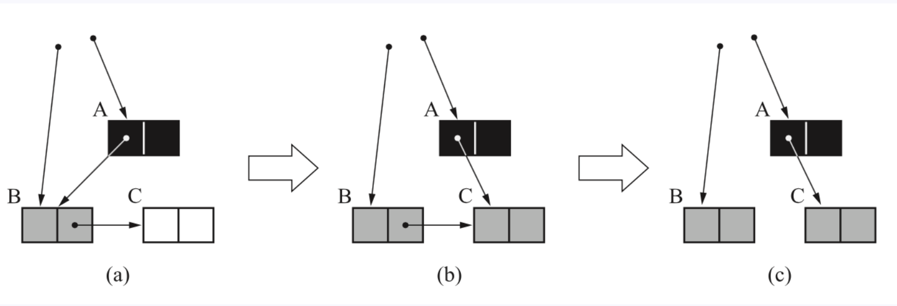

   更严厉版本：==黑色新增引用，黑色变灰色重新扫描==：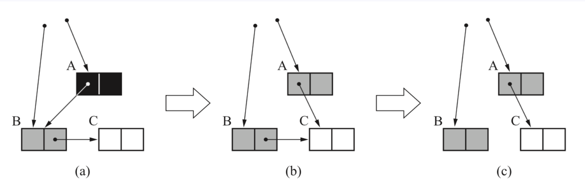

2. 原始快照（Snapshot At The Beginning，SATB）

   原始快照就是当灰色对象要删除指向白色对象的引用关系时，就将这个**要删除的引用记录下来**，在并发扫描结束之后，再将这些记录过的引用关系中的灰色对象为根，重新扫描一次，这样就能扫描到白色的对象，将白色对象直接标记为黑色(目的就是让这种对象在本轮 GC 清理中能存活下来，待下一轮 GC 的时候重新扫描，这个对象也有可能是浮动垃圾)

   针对**老**引用关系进行记录：灰色 -\\-> 白色：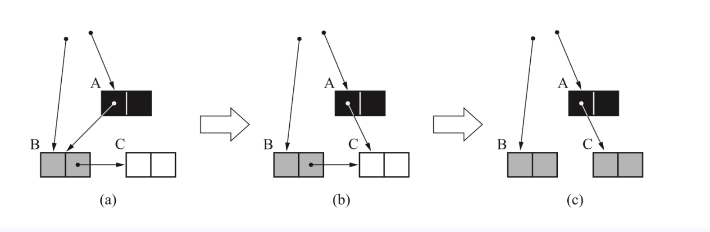

   - a 到 b 中，产生了一条由 A 到 C 的引用关系，这里并没有像增量更新那样将 A 或者 C 标为灰色，相反原始快照中允许出现从黑色指向白色的引用。
   - 而在从 b 到 c 中，删除了由 B 到 C 的引用关系。这时候就需要进行处理，将 C 涂为灰色。

以上无论是对引用关系记录的插入还是删除，虚拟机的记录操作都是通过写屏障实现的。

**写屏障**

给某个对象的成员变量赋值时，其底层代码大概长这样：

```c
/**
 * @param field 某对象的成员变量，如 a.b.d
 * @param new_value 新值，如 null
 */
void oop_field_store(oop field, oop new_value) {
    *field = new_value; // 赋值操作
}
```

所谓的写屏障，其实就是指在赋值操作前后，加入一些处理（可以参考AOP的概念）：

```c
void oop_field_store(oop* field, oop new_value) {
    pre_write_barrier(field); // 写屏障-写前操作
    *field = new_value;
    post_write_barrier(field, value); // 写屏障-写后操作
}
```

**写屏障实现 SATB**

当对象 B 的成员变量的引用发生变化时，比如引用消失（`a.b.d = null`），我们可以利用写屏障，**将 B 原来成员变量的引用对象 D 记录下来**：

```c
void pre_write_barrier(oop* field) {
    oop old_value = *field; // 获取旧值
    remark_set.add(old_value); // 记录原来的引用对象
}
```

**写屏障实现增量更新**

当对象 A 的成员变量的引用发生变化时，比如新增引用（`a.d = d`），我们可以利用写屏障，**将 A 新的成员变量引用对象 D 记录下来**：

```c
void post_write_barrier(oop* field, oop new_value) {
    remark_set.add(new_value); // 记录新引用的对象
}
```

**读屏障**

```c
oop oop_field_load(oop* field) {
    pre_load_barrier(field); // 读屏障-读取前操作
    return *field;
}
```

读屏障是直接针对第一步：`D d = a.b.d`，当读取成员变量时，一律记录下来：

```c
void pre_load_barrier(oop* field) {
    oop old_value = *field;
    remark_set.add(old_value); // 记录读取到的对象
}
```

现代追踪式（可达性分析）的垃圾回收器几乎都借鉴了三色标记的算法思想，尽管实现的方式不尽相同：比如白色/黑色集合一般都不会出现（但是有其他体现颜色的地方）、灰色集合可以通过栈/队列/缓存日志等方式进行实现、遍历方式可以是广度/深度遍历等等。
对于读写屏障，以 Java HotSpot VM 为例，其并发标记时对漏标的处理方案如下：

- CMS：写屏障 + 增量更新
- G1：写屏障 + SATB
- ZGC：读屏障

工程实现中，读写屏障还有其他功能，比如写屏障可以用于记录跨代/区引用的变化，读屏障可以用于支持移动对象的并发执行等。功能之外，还有性能的考虑，所以对于选择哪种，每款垃圾回收器都有自己的想法。

附上一道经典的面试题：
为什么 G1 用 SATB，CMS 用增量更新？
个人理解：因为原始快照相对于增量更新效率更高，当然不排除原始快照会在 GC 过程中产生更多的浮动垃圾，因为不需要在重新扫描阶段再次深度扫描被删除的对象。
而 CMS 对增量引用的根对象会做深度扫描，G1 因为很多对象都位于不同的 region，CMS 就一块老年代区域，重新深度扫描对象的话 G1 的代价会比 CMS 高，所以 G1 选择 SATB 不深度扫描对象，只是简单标记，等到下一轮 GC 再深度扫描。
**相对于来说原始快照方式比增量更新方式容易产生浮动垃圾，但是效率比增量更新要高。**
而 ZGC 有一个标志性的设计是它采用的染色指针技术，染色指针可以大幅减少在垃圾收集过程中内存屏障的使用数量，设置内存屏障，尤其是写屏障的目的通常是为了记录对象引用的变动情况，如果讲这些信息直接维护在指针中，显然可以省去一些专门的记录操作。而 ZGC 没有使用写屏障，只使用了读屏障，显然对性能大有裨益的。

##### 5.3.13 如何选择

SerialGC 串行收集器 复制算法 新生代 响应速度快 适合单核的客户端应用程序下。

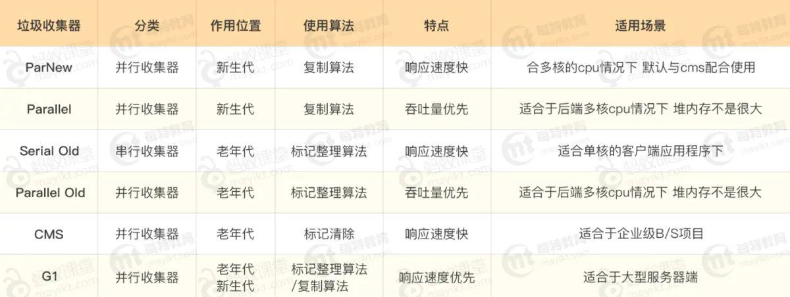

**组合选择：**

- 单 CPU 或小内存，单机程序：`-XX:+UseSerialGC`（复制+标记整理）
- 多 CPU，需要高吞吐量，如后台计算型应用：`-XX:+UseParallelGC/-XX:+UseParallelOldGC`（复制+标记整理）
- 多 CPU，追求低停顿时间，需要快速响应如互联网应用：`-XX:+UseConcMarkSweepGC`（复制+标记清除，会产生碎片）

### 5.4 结合 Spring Boot 实战


